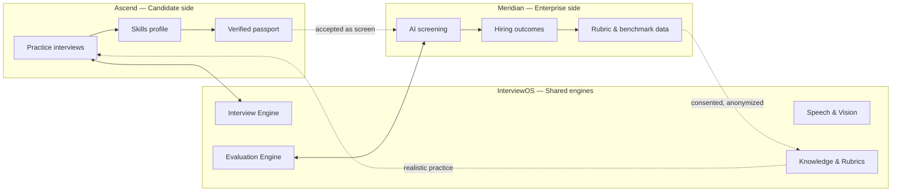
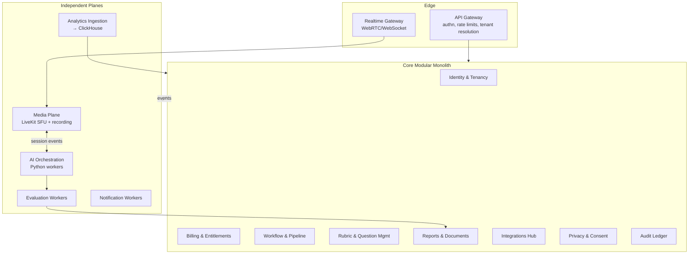
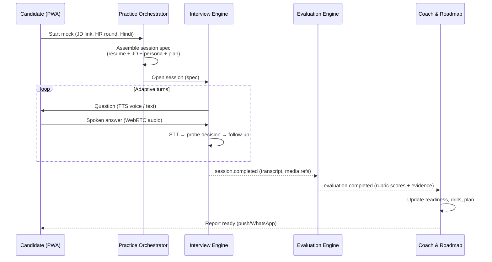
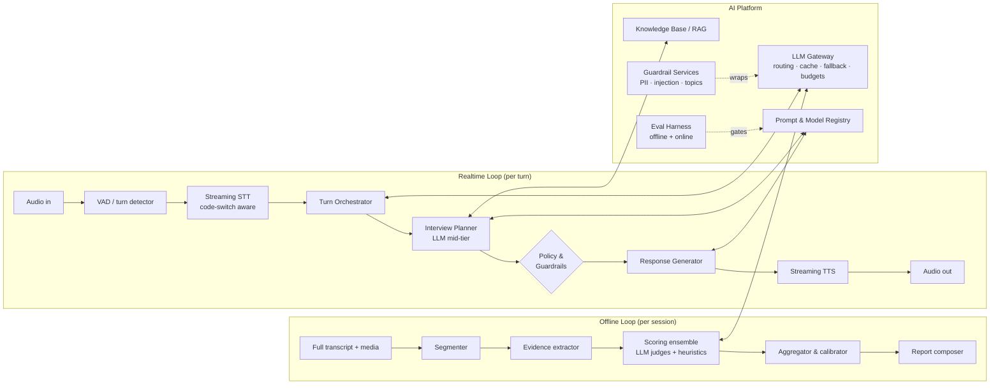
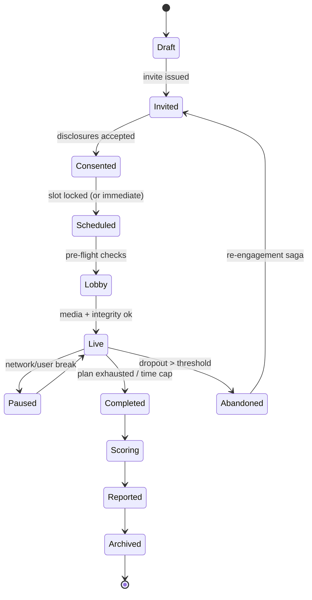
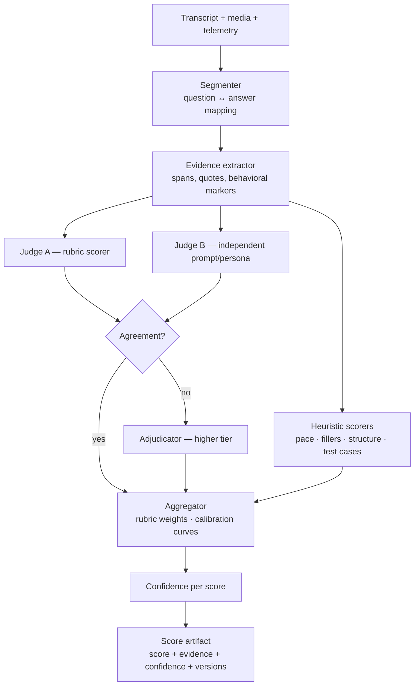
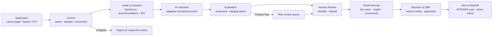
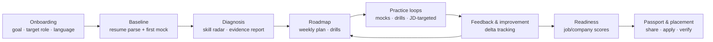
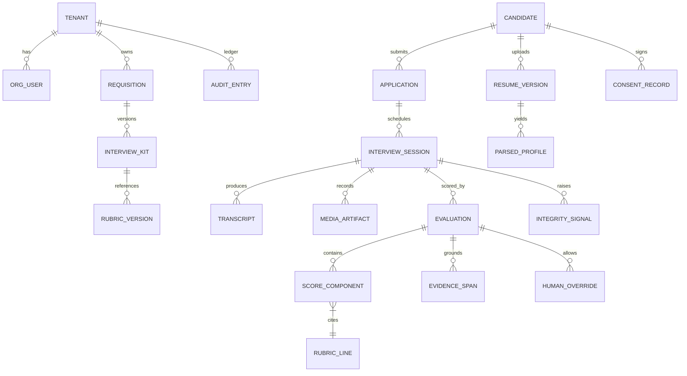
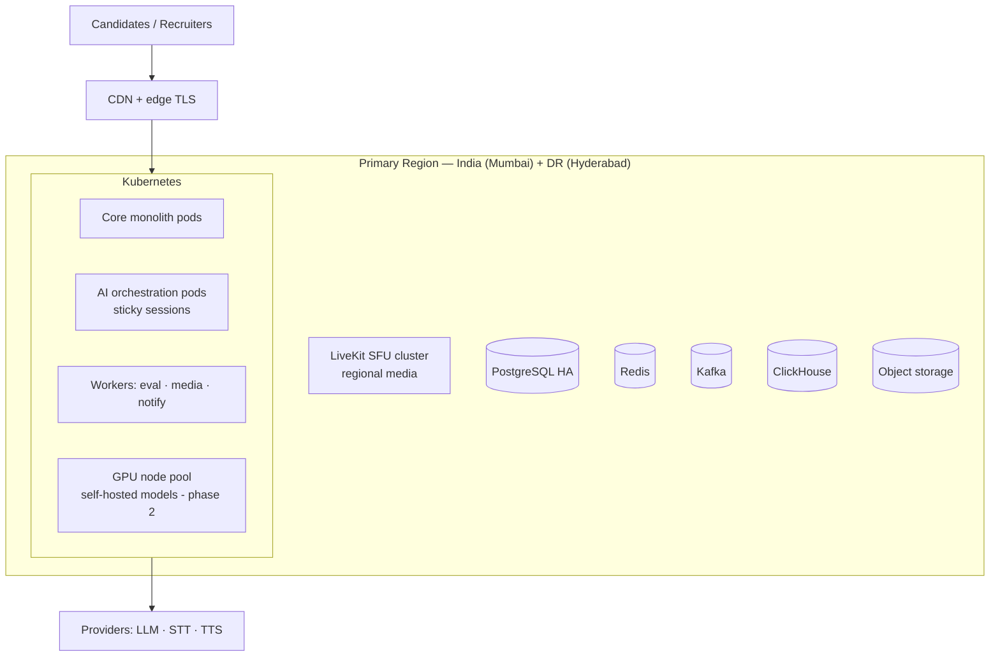

# AI Interview Ecosystem — Product & Engineering Blueprint

**A planning dossier for a two-product, one-platform AI interview company**
**Working names: `InterviewOS` (shared platform) · `Ascend` (candidate product) · `Meridian` (enterprise product)**
**Version 1.0 · July 2026 · Status: Pre-implementation planning**

---

## How to read this document

This dossier was prepared as the pre-build blueprint for a startup competing in the AI interview space against HireVue, Paradox, CodeSignal, Talview, Metaview, Eightfold, Vervoe, Final Round AI, Big Interview and adjacent players. It is deliberately opinionated: every major choice is framed as a decision with alternatives and trade-offs, and Section 24 lists everything still unresolved. Nothing here is implementation detail for its own sake — the goal is that a founding team could staff against this document, budget against it, and defend it in front of a technical diligence panel.

**Ground rules adopted for this blueprint:**

1. **India-first launch**, with architecture that does not trap us in India. Compliance, pricing, language support, and go-to-market are tuned for India in year one, with the US/EU designed-in but not launched.
2. **Two products, one spine.** Ascend (candidate-first prep) and Meridian (enterprise hiring) are independent deployables sharing `InterviewOS` engines. Everything reusable is reused; nothing is shared that would couple release cycles.
3. **Trust is the product.** Gartner reports only **26% of candidates trust AI to evaluate them fairly**, while **39% already use AI in their applications** and **6% admit to interview fraud**; Gartner projects **1 in 4 candidate profiles worldwide will be fake by 2028** [^88^][^86^]. The company that makes AI interviewing *legible, consented, and verifiable* wins both sides of the market.
4. **No stealth copilot.** We will not build a real-time "cheat assistant" for live interviews (Final Round AI's controversial headline feature [^4^]). Instead we build the *detector* for enterprises and the *coach* for candidates. This is a positioning decision, not only an ethics one — it keeps both products on the same side of the trust equation.
5. **Evidence-linked everything.** Every AI score, on both products, must cite the transcript/moment that produced it. This is our answer to NYC Local Law 144 bias audits [^41^], the EU AI Act's high-risk employment obligations [^49^], and to the candidate-trust gap.

---

## Table of Contents

1. Product Vision
2. User Personas
3. Problem Statements & Market Gaps
4. Functional Requirements
5. Non-Functional Requirements
6. Feature Prioritization
7. Shared Platform Architecture (`InterviewOS`)
8. Candidate Platform Architecture (`Ascend`)
9. Enterprise Platform Architecture (`Meridian`)
10. AI Architecture
11. Interview Engine
12. Evaluation Engine
13. Resume Intelligence
14. Enterprise Hiring Workflow
15. Candidate Learning Workflow
16. Database Design
17. API Design
18. Security
19. Infrastructure
20. AI Cost Analysis
21. Business Model
22. Competitive Analysis
23. Risks
24. Open Questions

---

# 1. Product Vision

## 1.1 Mission

**Make every interview — practiced or real — a fair, evidence-based, and genuinely useful conversation.** For candidates, that means world-class preparation that used to cost ₹15,000–₹40,000 in coaching classes, delivered by AI at the price of a monthly mobile recharge. For employers, that means hiring signal they can defend to a candidate, to an auditor, and to a court.

## 1.2 Long-term vision (5-year)

Become **the interview layer of the talent economy** in India and emerging markets: the system of record for *demonstrated ability*, as opposed to resumes (claimed ability) and degrees (proxied ability). Concretely:

- **Year 1:** Ascend launches in India — freemium AI mock interviews, resume intelligence, placement readiness. Meridian enters beta with 3–5 design partners in IT services / campus hiring.
- **Year 2:** Meridian GA with ATS integrations, integrity (anti-fraud) stack, and DPDP-aligned enterprise controls. Ascend adds vernacular-language coaching and campus (B2B2C) plans.
- **Year 3:** Cross-border expansion (SEA, Middle East, then US/EU once EU AI Act high-risk obligations land on **2 December 2027** [^49^]). Skills passport: a portable, verifiable interview-credential candidates own.
- **Years 4–5:** The skills passport becomes a hiring currency: employers accept Ascend-verified scores in lieu of first-round screens, closing the loop between our two products — the flywheel described in §1.5.

## 1.3 Competitive positioning

The market splits into four quadrants, and nobody credible occupies the intersection we want:

| Quadrant | Players | Their center of gravity |
|---|---|---|
| Enterprise interview automation | HireVue, Talview, Humanly, Spark Hire | Recruiter efficiency, per-interview pricing (₹1,650–₹5,000/interview in India [^27^]) |
| Conversational high-volume hiring | Paradox (Olivia), Humanly | Chat/SMS screening & scheduling for frontline roles [^44^] |
| Skills assessment | CodeSignal, Vervoe, iMocha, HackerRank | Validated tests, work samples, AI grading [^17^][^30^] |
| Candidate-side prep | Final Round AI, Big Interview, Interviewing.io, Pramp/Exponent, PrepInsta, InterviewBit, Rehearsal AI | Mock interviews, coaching, question banks [^4^][^14^][^16^] |

**Our position: the only candidate-trusted + enterprise-grade platform, priced for India, with interview integrity (anti-AI-fraud) as a first-class feature.** Each incumbent leaves a flank open:

- HireVue/Talview are priced for MNC procurement, not Indian mid-market; candidates resent one-way video interviews and distrust opaque scoring (only 26% trust AI evaluation [^88^]).
- Final Round AI is candidate-side only, US-priced (~$25–$148/month [^2^][^4^]), and its stealth copilot puts it on a collision course with employers — we take the other side of that trade.
- Interviewing.io proves candidates pay for realistic mocks ($179–$339/session [^1^]) but its human-interviewer model cannot scale to Indian volumes or prices.
- PrepInsta/InterviewBit own placement-prep *content* but not *performance*: PrepInsta Prime (₹3,399) is video courses with no voice practice [^16^]; InterviewBit has no mock interviews at all [^20^].
- Google Interview Warmup — the only free, loved, zero-friction practice tool — was **shut down in April 2026** [^18^], orphaning millions of users and vacating the top of the funnel.

## 1.4 Unique differentiators (the things we must be true for)

1. **Integrity-by-design for the AI era.** Deepfake detection, copilot-usage signals, voice liveness, ID verification, and writing-style forensics built into Meridian; 72% of recruiting leaders are already reverting to in-person rounds to fight AI fraud [^84^] — we sell them the alternative to that retreat.
2. **Explainable scoring, always.** Every score links to transcript evidence and a rubric line. Candidates see *why*; auditors see *how*. (Vervoe markets explainability [^29^]; nobody candidate-side does it.)
3. **India-native multilingual.** Hinglish code-switching, Hindi + major regional languages at launch — the exact weakness reviewers cite for Metaview (non-English transcription "unreliable") [^25^] and a moat Deepgram-class STT now makes affordable [^64^].
4. **Two-sided data flywheel with consent walls.** Enterprise rubrics make Ascend coaching realistic; Ascend's anonymized, consented practice corpus makes our evaluation models better. Nobody with only one product can replicate this.
5. **Price disruption.** Enterprise AI interviews at **₹99–₹299 per interview** versus Talview's ₹1,650–₹4,150 and HireVue's ₹2,000–₹5,000 in India [^27^]; candidate Pro at **₹399/month** against Final Round AI's ~$25–$90/month [^2^].

## 1.5 The ecosystem thesis (why two products are one company)



The flywheel has hard consent and tenancy walls (§16.4, §18): enterprise data never leaks into candidate-facing content in identifiable form, and candidate practice data is never sold or shared with employers except as a candidate-initiated, scoped **skills passport**. If that wall ever blurs, both products die — the candidate stops trusting us, and the employer's audit trail is poisoned.

---

# 2. User Personas

Personas are written for the India-first launch, with global analogues noted. Each persona lists: context → jobs-to-be-done → pains today → what we must be true for them.

## 2.1 Candidate side (Ascend)

**P1 — "Tier-2/3 engineering fresher" (primary).** Final-year student at a Tier-2/3 college in, say, Coimbatore or Indore; first-generation professional. JTBD: clear campus placement filters (aptitude → coding → technical → HR) at TCS/Infosys/Wipro-scale recruiters and, aspirationally, product companies. Pains: placement cell has 1 trainer per 600 students; English fluency anxiety; no one to rehearse HR answers with; PrepInsta videos don't tell him *how he sounds*. Context anchor: only **42.6% of Indian graduates are employable**, and the sharpest deficits are non-technical — communication, critical thinking [^80^][^90^]. Must be true: works on a ₹12,000 Android phone over 4G; ₹0 to start, ₹399/mo ceiling; feedback in simple English or Hindi; visible progress within a week.

**P2 — "Product-company aspirant."** 1–4 years at a services company, preparing for SDE roles at product companies/GCCs. JTBD: DSA + system design + behavioral prep; company-specific patterns (Amazon LP, Google GCA). Pains: InterviewBit/LeetCode cover coding but not the conversation; Interviewing.io-class human mocks cost $179+ [^1^] — nearly a month's savings. Must be true: realistic adaptive interviewer that probes like a real one, coding co-pilot-style practice with an IDE, brutal-but-fair scoring, offline/async practice slots around a job.

**P3 — "Career switcher / returner."** 27–38, moving into tech-adjacent roles (analytics, QA, PM) or returning after a break. JTBD: translate past experience into credible interview narratives; rebuild confidence. Pains: doesn't know what she doesn't know; generic question banks don't map her background to the target role. Must be true: resume-to-role gap analysis, personalized roadmap, judgment-free voice practice.

**P4 — "Non-tech job seeker."** BPO, sales, banking, retail roles. JTBD: clear HR/communication rounds and voice-based screening (which is exactly where employers deploy AI screening first). Pains: almost zero prep tooling exists for non-tech interviews in Indian languages. Must be true: voice-first, vernacular, cheap, mobile-only.

**P5 — "Anxious international applicant" (V2+).** Indian candidate applying to US/EU employers or universities. Needs: practice against Western interview norms, visa-aware job contexts, accent-comprehensibility feedback (framed as communication coaching, never as accent "correction" scoring — see §18.6 on bias).

## 2.2 Enterprise side (Meridian)

**P6 — "High-volume recruiter, IT services / BPO."** Runs 200–2,000 screens/month for voice and tech support roles; KPIs are time-to-fill and cost-per-hire. Pains: 90% of applicants fail basic communication screens, but each screen still costs 15 minutes of a human; offer-to-join ratios collapse because candidates treat the process as opaque. Must be true: AI voice screens in English + Hindi, per-interview pricing he can defend to finance, fraud signals (the person who joins is the person who interviewed), Naukri/foundit + ATS integration.

**P7 — "Campus hiring lead."** Visits 60 campuses/season; 10,000+ applicants per batch. Pains: logistics of proctored tests; inconsistent interviewer quality across panels; no comparability across campuses. Must be true: standardized AI first-round at ₹/interview economics, proctoring/integrity, cohort analytics by campus, and — uniquely — a pipeline of students who *already practiced on Ascend* and arrive warmer (the ecosystem advantage).

**P8 — "Hiring manager (tech)."** Engineering director who owns interview quality but loses 6 hours/week to panels. Pains: interview notes are garbage; debriefs are politics; Bar-raiser calibration drifts. Must be true: structured scorecards auto-drafted from the interview (Metaview-class note-taking [^25^] but natively multilingual), evidence-linked feedback, panel calibration analytics.

**P9 — "HR / TA head."** Owns process compliance and candidate experience. Pains: bias-audit readiness (for MNC clients and their US/EU operations subject to NYC LL144 [^41^]); DPDP obligations now that the Rules are notified [^50^]; Glassdoor/LinkedIn reputation from candidate ghosting stories. Must be true: consent-first candidate flows, exportable audit trails, adverse-impact dashboards, DPDP-compliant retention/erasure.

**P10 — "Enterprise admin / IT security."** Gatekeeper. Needs: SSO/SCIM, data residency in India, encryption, vendor security docs, DPA, on-prem/VPC options for BFSI. Note: the McDonald's–Paradox breach (64M applicant records exposed via a `123456` test-account password [^46^]) is the story every CISO now tells in vendor reviews — our security posture (§18) is written to survive that meeting.

**P11 — "Interviewer / panel member."** Wants: question guidance, no admin work, fair scoring help. Pains: context-switching, writing feedback. Must be true: copilot-style live support that *assists the interviewer* (legal, disclosed) — the mirror image of the candidate-side stealth copilot we refuse to build.

**P12 — "University placement officer / training institute."** Buys Ascend in bulk for cohorts. Pains: must show placement-rate improvement to justify budget; needs cohort dashboards, not individual snooping. Must be true: aggregate analytics, curriculum-aligned practice plans, ₹/student/year pricing that beats one visiting-faculty honorarium.

---

# 3. Problem Statements & Market Gaps

## 3.1 Candidate-side problems

**CP-1 — Practice doesn't reproduce pressure.** Watching PrepInsta videos or solving InterviewBit problems builds knowledge, not *performance under interrogation*. The 15 minutes that decide the offer are performative; the tooling for rehearsing performance is either human-expensive (₹2,000+/session coaching; $179–$339 on Interviewing.io [^1^]) or toy-like (Google Warmup gave 5 generic questions and no scoring before it was retired [^18^]).

**CP-2 — Feedback is absent or useless.** "Be more confident" is not feedback. Candidates need rubric-level diagnosis: *your STAR answer skipped the Result; your pace was 190 wpm under pressure; 34% of your answer was fillers; your system-design answer never mentioned consistency trade-offs.* No candidate-side product in India delivers evidence-linked feedback today.

**CP-3 — English-fluent metro bias.** Tools assume fluent English and a laptop. The employability gap is steepest exactly in communication skills [^80^][^90^], and the students with the least access to coaching are the ones the tools serve worst.

**CP-4 — Preparation is not portable.** A candidate who practiced 40 hours has nothing verifiable to show for it. No credential, no evidence, no way to convert preparation into an admissions advantage with employers.

**CP-5 — The free tier of the internet just disappeared.** Google Interview Warmup's April 2026 shutdown [^18^] removed the default zero-cost practice habit; the vacuum is an acquisition opportunity.

## 3.2 Enterprise-side problems

**EP-1 — Screening economics are broken.** Recruiters spend most of their hours on screens that mostly fail. Paradox proved the automation value at the top of funnel (Chipotle cut time-to-hire 75%; GM saved $2M/yr [^44^]) but at enterprise prices ($25K–$100K+/yr [^44^]) and for chat-centric frontline flows — not for India's voice-first, mixed-language, tech+non-tech volume.

**EP-2 — Trust collapse in remote assessment.** 6% of candidates admit interview fraud; 17% of hiring managers report encountering deepfakes; one security firm flagged 23.2% of applicants in a quarter as fraud risks [^88^][^84^][^77^]. The industry's response — dragging candidates back in person (72% of recruiting leaders [^84^]) — is an admission that current tooling has no answer. This is the single largest product vacuum in the market.

**EP-3 — Opaque AI is becoming illegal, not just unpopular.** NYC LL144 demands annual independent bias audits, public postings, and 10-business-day candidate notice, with per-day penalties and a newly aggressive enforcement posture after the December 2025 Comptroller audit [^41^][^43^]. Illinois requires disclosure, explanation, written consent, and 30-day video deletion on request for AI-analyzed interviews [^52^][^58^]. The EU AI Act classifies employment AI as high-risk (obligations from Dec 2027) and **bans workplace emotion recognition outright** [^48^][^49^]. India's DPDP Rules (notified Nov 2025) bring consent, breach-notification (72h), and erasure duties with penalties up to ₹250 crore [^50^]. Vendors whose scoring is a black box will be regulated out of enterprise deals; explainability is a sales feature now.

**EP-4 — Interview data is wasted.** Interviews are the richest signal in hiring and the least captured. Metaview built a business just on notes ($20–$50/user/mo [^25^]) — evidence that interview intelligence is valuable — but it doesn't do interviews, and it's weak outside English [^25^].

**EP-5 — Fragmentation.** Scheduling (GoodTime), notes (Metaview), assessment (CodeSignal/Vervoe), video interviewing (HireVue), chatbot (Paradox) — five vendors, five integrations, five DPAs. Mid-market India cannot buy or operate this stack.

## 3.3 Gap synthesis → what we build

| # | Gap | Our answer | Product |
|---|---|---|---|
| G1 | Affordable realistic practice | AI adaptive mock interviews, voice-first, ₹0/₹399 | Ascend |
| G2 | Evidence-linked feedback | Rubric + transcript-cited scoring reports | Ascend (via Evaluation Engine) |
| G3 | Vernacular/mobile-first | Hinglish code-switch STT, audio-only low-bandwidth mode, PWA | Both |
| G4 | Portable proof of readiness | Consented skills passport with verification API | Ascend → Meridian |
| G5 | Cheap, defensible screening | AI interviewer at ₹99–299/interview with audit trail | Meridian |
| G6 | Fraud/integrity vacuum | Integrity stack: liveness, deepfake, copilot & device signals, IDV | Meridian |
| G7 | Compliance-by-design | Consent manager, bias-audit exports, DPDP retention engine | Meridian (platform-level) |
| G8 | Interview intelligence | Auto scorecards, panel calibration, funnel analytics | Meridian |
| G9 | Fragmentation | One platform: schedule → interview → score → report → ATS sync | Meridian |
| G10 | Warmup's orphaned users | Free-forever practice tier + SEO on "interview warmup" intent | Ascend |

---

# 4. Functional Requirements

Features are cataloged per product with IDs used throughout this dossier (`AS-` = Ascend, `ME-` = Meridian, `OS-` = shared platform capability surfaced in both). Each feature carries: **Why it exists · Who needs it · Priority tier** (MVP / V2 / Enterprise / Cut — full rationale in §6).

## 4.1 Ascend (Candidate Platform) — feature catalog

### 4.1.1 Practice & mock interviews

| ID | Feature | Why it exists / who needs it | Tier |
|---|---|---|---|
| AS-P1 | **Adaptive AI mock interview (voice)** — realtime spoken interview with follow-ups that probe the candidate's actual answers | Core value; all personas. Adaptive probing is what separates rehearsal from recitation (the lesson of scripted-vs-conversational tools [^35^]) | MVP |
| AS-P2 | **Interview types library** — HR, behavioral (STAR), technical concepts, coding, system design, role-specific (sales, support, banking), company-pattern packs | Breadth of the placement funnel (P1) and lateral moves (P2) | MVP (HR/behavioral/technical), V2 (coding + system design depth) |
| AS-P3 | **JD-targeted mock** — paste a job description (or share a posting link); interview generated against it + candidate's resume | Highest-leverage personalization; ClavePrep proves the mechanic [^14^] | MVP |
| AS-P4 | **Difficulty & persona controls** — friendly campus recruiter → bar-raiser; stress-test mode | P2 needs calibration against real bar | V2 |
| AS-P5 | **Audio-only low-bandwidth mode** — full experience on 2G/3G-class links, <100 MB/hour | P1/P4 reality: ₹12,000 phones, hostel Wi-Fi | MVP |
| AS-P6 | **Text/chat practice mode** — same engine, typed answers | Accessibility, quiet-hostel constraint, entry ramp | MVP |
| AS-P7 | **Coding co-practice** — shared IDE, AI interviewer discusses approach while candidate codes; auto-run test cases | P2 core; Interviewing.io-class realism without $179 [^1^] | V2 |
| AS-P8 | **Group discussion simulator** — multi-agent GD with AI peers | Indian campus/SSC/MBA reality; nobody does it | V2 |
| AS-P9 | **Company-pattern packs** — TCS NQT, Infosys, Amazon LP, Google-style rubrics (from public patterns + licensed content, never scraped confidential questions) | P1/P2 demand; SEO/ASO magnet | V2 |
| AS-P10 | **Peer practice rooms** — Pramp-style peer mocks with our rubric as scaffolding | Community retention, near-zero COGS | V2 |
| AS-P11 | **Real-time "copilot" for live third-party interviews** | **CUT.** This is Final Round AI's stealth feature [^4^]; it brands us as fraud infrastructure, poisons enterprise trust, and is increasingly detectable | **Cut (policy)** |

### 4.1.2 Feedback, scoring & analytics

| ID | Feature | Why | Tier |
|---|---|---|---|
| AS-F1 | **Evidence-linked interview report** — per-question scores, transcript citations, rubric lines, improvement tips | The differentiator (G2); candidate trust | MVP |
| AS-F2 | **Communication analytics** — pace, fillers, pause discipline, answer structure, STAR completeness, listening behavior | CP-2; the #1 fresher gap per employability data [^80^] | MVP |
| AS-F3 | **Delivery coaching drills** — targeted micro-exercises (e.g., "answer in 90 seconds, ≤3 fillers") | Converts diagnosis into practice; retention | V2 |
| AS-F4 | **Confidence & composure indicators (speech-only)** — derived from delivery metrics, framed as coaching | Valuable signal — but see constraint below | MVP (constrained) |
| AS-F5 | **Progress dashboard** — score history, skill radar, streaks | Retention, habit loop | MVP |
| AS-F6 | **Readiness scores** — Job Readiness (per role) and Company Readiness (per pattern) with transparent formula | The metric users share; passport foundation | V2 |
| AS-F7 | **Interview replay with annotations** — jump to moments cited in feedback | Learning loop | MVP |
| AS-F8 | **Comparative benchmarks** — "vs. successful candidates for this role band" (anonymized cohort) | Calibration; only credible with scale | V2 |

> **Design constraint on AS-F4 and all "confidence" features.** The EU AI Act has **banned emotion recognition in workplace contexts since Feb 2025** [^48^][^49^], and several US jurisdictions treat inference about internal states as radioactive. Our rule, applied platform-wide: **we measure observable delivery behavior (pace, fillers, structure, responsiveness), never inferred emotions or personality.** Reports say "you spoke 22% faster under follow-up pressure," never "you seemed nervous." This keeps every Ascend feature sellable into enterprise contexts later and keeps coaching honest.

### 4.1.3 Resume & career intelligence

| ID | Feature | Why | Tier |
|---|---|---|---|
| AS-R1 | **Resume upload & parsing** → structured profile | Feeds JD-targeting, gap analysis | MVP |
| AS-R2 | **ATS-readiness check** — format, keyword, parse-risk analysis with fixes | Universal ask; SEO wedge | MVP (1 free check) |
| AS-R3 | **Resume ↔ JD match report** — coverage matrix, missing keywords, bullet rewrites (with honesty guardrails: no invented metrics) | P1–P3; high shareability | MVP |
| AS-R4 | **Skill inference & gap analysis** — inferred skill graph vs. target role → what to learn/practice | Powers roadmap (AS-L1) | V2 |
| AS-R5 | **Question prediction** — "interviewers will likely ask these 12 things about *your* resume" | Delight moment; drives first mock | V2 |
| AS-R6 | **Resume builder** — clean templates, ATS-safe export | Adjacent utility; commoditized | V2 (or partner) |

### 4.1.4 Learning roadmap & plans

| ID | Feature | Why | Tier |
|---|---|---|---|
| AS-L1 | **Personalized practice plan** — weekly plan generated from readiness gaps; adapts after each session | Retention engine; converts mocks into outcomes | V2 |
| AS-L2 | **Learning content library** — short, practice-linked lessons (STAR, system-design primer, HR frameworks) | Light content; we are not a course platform (PrepInsta owns that, badly) | V2 |
| AS-L3 | **Placement calendar & trackers** — drives, deadlines, application pipeline mini-CRM | P1 stickiness, cheap to build | V2 |
| AS-L4 | **Human coach marketplace** — book a vetted human mock (₹999–₹2,499) with our rubric + recording; we take a margin | Interviewing.io economics localized; trust halo; monetizes power users | V2/V3 |

### 4.1.5 Account, social & misc

| ID | Feature | Why | Tier |
|---|---|---|---|
| AS-A1 | OTP/social login, profile, target-role onboarding | Baseline | MVP |
| AS-A2 | **Skills passport** — verifiable, scoped, shareable score credential with expiry and re-verification | G4; long-term flywheel | V3 |
| AS-A3 | Referral & streak mechanics, WhatsApp nudges (consented) | India-appropriate growth loops | V2 |
| AS-A4 | Multilingual UI + vernacular feedback (Hindi first) | G3 | V2 |
| AS-A5 | Campus/institute portal (bulk licenses, cohort dashboards) | B2B2C revenue; P12 | V2 |
| AS-A6 | Parent-friendly "explain my report" share view | Indian purchase influencer reality | V3 (nice) |

## 4.2 Meridian (Enterprise Platform) — feature catalog

### 4.2.1 Requisition & pipeline

| ID | Feature | Why | Tier |
|---|---|---|---|
| ME-P1 | **Requisition & role builder** — JD intake → skill framework → interview plan (auto-drafted) | Entry point; Vervoe's JD→assessment generation [^30^] validates the mechanic | MVP |
| ME-P2 | **Candidate pipeline board** — stages, bulk actions, SLA timers | Recruiter home | MVP |
| ME-P3 | **Application intake** — career-page widget, CSV, ATS pull, Naukri/foundit sourcing hooks | India sourcing reality | MVP |
| ME-P4 | **Resume screen & dedupe** — parse, match-score vs. role, duplicate/fraud-merge detection | Volume triage | MVP |
| ME-P5 | **Knockout & eligibility flows** — criteria, shifts, location, work authorization | High-volume basics (Paradox-class [^44^]) | MVP |
| ME-P6 | Talent pool CRM & rediscovery | V2 | V2 |

### 4.2.2 Interviewing

| ID | Feature | Why | Tier |
|---|---|---|---|
| ME-I1 | **AI voice/video screening interview (async + live-AI)** — structured, role-tuned, multilingual, with dynamic follow-ups | The product. HireVue/Talview capability at India economics | MVP |
| ME-I2 | **Adaptive depth probing** — follow-ups generated from the candidate's own answers, contradiction probing | Anti-script defense (the NeoRecruit-vs-Talview lesson [^35^]) | MVP |
| ME-I3 | **Live human interview room** — WebRTC panel interviews with scheduler, structured scorecards, interviewer copilot (question suggestions, coverage tracker, auto-notes) | Enterprises still need human rounds; captures the full interview estate, not just AI screens | V2 |
| ME-I4 | **One-way (async) video Q&A** | Legacy table stakes (HireVue-style) | MVP |
| ME-I5 | **Coding & skills assessments** — IDE, test cases, plagiarism checks | Technical hiring; CodeSignal adjacency [^17^] | V2 |
| ME-I6 | **Work-sample tasks** — spreadsheets, writing samples, role plays | Vervoe validated [^30^] | V2 |
| ME-I7 | **Scheduling automation** — self-scheduling, panel coordination, reminders (WhatsApp/SMS/email), no-show recovery | GoodTime-class pain [^42^]; highest immediate recruiter ROI | MVP |
| ME-I8 | **Interviewer enablement** — training content, calibration quizzes, shadowing workflows | Interview quality is the enterprise's weakest muscle | V2 |
| ME-I9 | **Reference checks** — automated outreach, structured questions from skill framework | Vervoe pattern [^30^] | V3 |

### 4.2.3 Integrity & proctoring (the differentiator suite)

| ID | Feature | Why | Tier |
|---|---|---|---|
| ME-T1 | **Identity verification** — govt-ID + selfie match at invite (India: Aadhaar XML/DigiLocker where permissible; global: doc vendors) | Fraud EP-2: person who interviews = person who joins [^77^] | MVP |
| ME-T2 | **Voice liveness & deepfake screening** — synthetic-voice and face-swap signals on interview media | 17% of hiring managers report deepfake encounters [^84^] | MVP (voice), V2 (video) |
| ME-T3 | **Copilot-usage signals** — gaze/reading patterns, answer-latency fingerprints, LLM-text stylometry on responses, second-screen heuristics — all disclosed, consent-gated | The enterprise answer to Final Round AI-class tools | V2 |
| ME-T4 | **Assessment proctoring** — browser lockdown, tab-switch/screen events, environment scan | Coding/test integrity | V2 |
| ME-T5 | **Impersonation risk score & review queue** — fused signals, human review workflow, disposition audit | Fraud ops console | V2 |
| ME-T6 | **Offer-to-join continuity check** — verify joiner vs. interviewee at onboarding handshake | Closes the fraud loop (bait-and-switch) | V3 |

> **Integrity ethics line (binding).** All integrity signals are: disclosed to the candidate pre-interview (also a legal requirement — Illinois AIVIA [^52^]), aggregated into a *risk review* rather than an auto-reject, and never based on protected-characteristic inference. We sell "verify the human," not "surveil the human."

### 4.2.4 Evaluation, collaboration & analytics

| ID | Feature | Why | Tier |
|---|---|---|---|
| ME-E1 | **Auto-generated interview scorecards** — rubric scores + evidence quotes + summary, human-editable | P8/P11; Metaview-class value [^25^] natively multilingual | MVP |
| ME-E2 | **Candidate comparison views** — side-by-side evidence, not side-by-side vibes | Hiring decisions | MVP |
| ME-E3 | **Debrief & decision workflows** — structured debrief, decision log, reasons captured | Auditability; EP-3 | V2 |
| ME-E4 | **Hiring analytics** — funnel conversion, time-in-stage, source quality, interviewer calibration drift, offer-join tracking | P7/P9 | MVP (core), V2 (advanced) |
| ME-E5 | **Adverse-impact & fairness dashboard** — selection rates, impact ratios (four-fifths rule [^41^]) by stage, exportable for audits | LL144-readiness is a sales feature; no India vendor ships this | V2 (design from day 1) |
| ME-E6 | **Bias-audit export pack** — model cards, rubric versions, sample artifacts, data lineage, one-click evidence bundle for independent auditors | Turns compliance from cost into moat | V2 |
| ME-E7 | **Custom rubric studio** — enterprise-defined competencies, weights, exemplars | Enterprise deals demand it | Enterprise |
| ME-E8 | Quality-of-hire loop — post-hire performance linkage to interview signals | The holy grail; needs 12+ months of data | V3 |

### 4.2.5 Platform & admin

| ID | Feature | Why | Tier |
|---|---|---|---|
| ME-A1 | **SSO (SAML/OIDC), SCIM, RBAC, audit logs** | P10 gate | Enterprise (MVP-lite: SSO + RBAC) |
| ME-A2 | **Data residency & retention controls** — India residency default, per-tenant retention schedules, erasure workflows (DPDP [^50^]) | Legal + deals | MVP-lite, Enterprise full |
| ME-A3 | **ATS integrations** — Zoho People, Keka, Darwinbox, Freshteam (India); Greenhouse/Lever/Workday/iCIMS (global, phased) | Non-negotiable; two-way sync | MVP (2), V2 (6+) |
| ME-A4 | **Public API + webhooks** — interview-as-a-service for ATS/HCM partners | Platform revenue; §17 | V2 |
| ME-A5 | **White-label / embedded mode** — institute and RPO partners | Channel economics | Enterprise |
| ME-A6 | **VPC / single-tenant deployment** | BFSI, IT-services giants | Enterprise |

## 4.3 Shared platform surfaces (user-visible)

| ID | Feature | Why | Tier |
|---|---|---|---|
| OS-U1 | Unified notification center (email/SMS/WhatsApp/push) with consent registry | Both products; DPDP consent discipline [^50^] | MVP |
| OS-U2 | Consent & privacy center — disclosures, recordings access, erasure requests, consent receipts | Illinois/DPDP/GDPR mechanics, productized | MVP |
| OS-U3 | Recording & playback service with signed URLs and watermarking | Both | MVP |
| OS-U4 | Report renderer (candidate report / scorecard / audit pack) from one evidence model | One rendering pipeline, two skins | MVP |

## 4.4 Screen inventories (exhaustive)

**Ascend (mobile-first PWA + native shell later):** onboarding (goal, target role, experience, language) · home (next best action) · practice lobby (interview types, JD target, settings) · pre-flight check (mic/network/consent) · live interview (voice/text/IDE variants) · intermission & resume flow · report (summary → rubric detail → evidence moments → drills) · replay · progress (radar/history/streaks) · readiness (job/company) · resume hub (upload, ATS check, JD match, builder) · roadmap · library · marketplace (coaches) · profile/settings/privacy center · campus portal (separate role).

**Meridian (web):** dashboard · requisitions & role builder · pipeline board · candidate profile (timeline, evidence, integrity panel, notes) · interview kit builder (rubrics, questions, plan) · invite & scheduling center · live interview room (+copilot, scorecard) · async review queue · evaluation workspace (comparison, debrief) · integrity console (risk queue, dispositions) · analytics (funnel, calibration, fairness) · integrations · admin (SSO/SCIM/RBAC/retention/residency) · audit & compliance center · billing.

---

# 5. Non-Functional Requirements

NFRs are stated as measurable targets with the *why* attached. India-first constraints (bandwidth, devices, price) dominate several of these.

## 5.1 Performance & latency

| NFR | Target | Why |
|---|---|---|
| Voice turn-taking (candidate stops → AI starts) | **P50 < 1.2 s, P95 < 2.0 s** | Above ~2 s the illusion of conversation breaks; below 1 s feels interruptive. This is the hardest NFR in the system and drives §10.4 design |
| STT partial transcript latency | P50 < 300 ms | Needed for responsive barge-in and live captions (Deepgram-class streaming runs 200–300 ms [^66^]) |
| LLM first-token (interviewer turn) | P50 < 800 ms on routed mid-tier model | Turn budget math in §20 |
| Report generation post-interview | P95 < 90 s | Candidate is waiting; anxiety window |
| Async video upload start | < 5 s on 1 Mbps uplink | Tier-2/3 networks; chunked resumable upload |
| PWA cold start (mid-tier Android, 4G) | < 3 s to interactive; app shell < 500 KB gz | P1 device reality |
| Dashboard queries (Meridian) | P95 < 2 s at tenant scale 5M candidates | Analytics engine (§7) sizing |

## 5.2 Availability & reliability

| NFR | Target |
|---|---|
| Ascend availability | 99.9% monthly (exam-season peaks matter: placement season, drive days) |
| Meridian availability | 99.95% monthly; live interview subsystem isolated so an analytics outage never kills an in-flight interview |
| Interview session resilience | Client reconnect ≤ 10 s with state recovery; **local media capture with post-hoc upload** so a network drop never loses interview evidence |
| RPO / RTO | RPO ≤ 5 min (event-sourced core), RTO ≤ 60 min |
| Degradation policy | Ordered shed: analytics → non-critical AI enrichment → video (fall back to audio) → TTS persona (fall back to text+STT). Interview capture is the last thing to degrade |

## 5.3 Scalability

| Dimension | Year-1 assumption | Design ceiling |
|---|---|---|
| Concurrent live AI interviews | 2,000 | 50,000 (media-plane horizontal scale, §19) |
| Stored interview hours | 200K | 20M (object storage, tiered) |
| Ascend MAU | 300K | 10M |
| Meridian candidates/tenant | 500K | 50M |
| Burst | 20× daily peak during campus drives | Queue-absorbed (async invites), live capacity auto-scaled on K8s HPA + KEDA |

## 5.4 Security, privacy & compliance (summary; full treatment §18)

Encryption in transit (TLS 1.3) and at rest (AES-256, per-tenant DEKs via KMS envelope); India data residency by default with region pinning; DPDP consent artifacts, 72-hour breach notification runbooks, erasure workflows [^50^]; AIVIA-style AI-disclosure + consent before any AI-analyzed video [^52^]; LL144-support artifacts (bias-audit export, impact-ratio computation) [^41^]; EU AI Act high-risk readiness: technical documentation, logging, human-oversight hooks, **no emotion-recognition features anywhere** [^49^][^48^]; SOC 2 Type II roadmap (§18.7); ISO 27001 by year 2 (enterprise table stakes — Vervoe already markets it [^29^]).

## 5.5 Accessibility & inclusion

WCAG 2.2 AA across both products; live captions in all interviews; text-equivalent paths for every voice interaction (AS-P6); keyboard-only operation; screen-reader-verified report views; color-independent scoring visuals; hearing-impaired candidates get full parity via text mode (an accessibility feature that doubles as our low-friction entry ramp); dyslexia-friendly reading options in reports. Accessibility is also a fairness control: assessment accommodations (extended time, format alternatives) are first-class entities in the rubric engine, not ad-hoc recruiter overrides.

## 5.6 Localization

Architecture-level: all user-facing strings externalized; STT/TTS language-agnostic via provider abstraction; rubrics and feedback templates versioned per language; **feedback quality parity is an explicit eval metric per language** (§10.7), not an afterthought. Launch: English (Indian), Hindi, Hinglish code-switch. V2: Tamil, Telugu, Marathi, Kannada, Bengali (matching where Talview claims 50+ languages [^27^] — but with measured parity rather than claimed coverage).

## 5.7 Cost ceilings (treated as NFRs)

| Metric | Ceiling |
|---|---|
| AI COGS per 30-min voice mock interview | ≤ ₹50 year-1, trending ≤ ₹25 by month 18 (see §20) |
| AI COGS per enterprise AI screen (12–15 min) | ≤ ₹18 |
| Infra (non-AI) per MAU | ≤ ₹6/month at 300K MAU |
| Gross margin (blended, year 1 exit) | ≥ 70% |

## 5.8 Observability & auditability

Structured logs with tenant/session/cost correlation IDs; traces across media plane → STT → LLM → scoring; per-request AI cost attribution (which feature, which model, which tenant); LLM prompt/response journaling (PII-redacted) for eval and dispute resolution; immutable audit log for all evaluation and integrity decisions (hash-chained); fairness metrics computed continuously, not quarterly. Every AI decision must be reconstructible: *inputs, prompt version, model version, rubric version, output, human override* — this is both an LL144 artifact [^41^] and our internal quality loop.

## 5.9 Cloud portability & vendor independence

No proprietary-cloud-only primitives in core paths: Kubernetes + Terraform everywhere; S3-compatible object storage; Postgres-compatible relational; Kafka-compatible streaming; OpenAI-compatible LLM gateway abstraction with ≥2 providers live at all times (§10.2); STT/TTS behind provider interfaces with benchmark harness (swap in 2 weeks, proven quarterly). Rationale: price-negotiation leverage, sovereignty requirements (some enterprise/govt deals will demand in-country or on-prem), and survival if a vendor pulls a Warmup-style shutdown on a dependency [^18^].

---

# 6. Feature Prioritization

## 6.1 Method

Features were scored on six questions (the brief's own product-thinking lens): retention, revenue, hiring/candidate outcomes, engineering complexity (reverse), trust/compliance impact, and ecosystem leverage (does it feed both products?). Scores 1–5, weighted: outcomes ×3, revenue ×3, retention ×2, trust ×2, ecosystem ×2, complexity ×−2. The point of the table is not false precision — it is to force the argument into the open.

## 6.2 Tier assignments (abridged — highest-signal rows)

| Feature | Outcomes | Rev | Ret | Trust | Eco | Cx | Weighted | Tier |
|---|---|---|---|---|---|---|---|---|
| AS-P1 Adaptive voice mock | 5 | 4 | 5 | 4 | 5 | 4 | **4.5** | MVP |
| AS-F1 Evidence-linked report | 5 | 4 | 4 | 5 | 5 | 3 | **4.6** | MVP |
| AS-P3 JD-targeted mock | 5 | 4 | 4 | 3 | 4 | 2 | **4.2** | MVP |
| AS-P5 Low-bandwidth mode | 4 | 3 | 4 | 4 | 3 | 3 | **3.8** | MVP |
| ME-I1 AI screening interview | 5 | 5 | 4 | 4 | 5 | 4 | **4.5** | MVP |
| ME-I7 Scheduling automation | 4 | 5 | 3 | 3 | 2 | 2 | **3.9** | MVP |
| ME-T1 Identity verification | 4 | 4 | 2 | 5 | 3 | 3 | **3.9** | MVP |
| ME-E1 Auto scorecards | 5 | 4 | 3 | 4 | 4 | 3 | **4.1** | MVP |
| AS-P7 Coding co-practice | 4 | 4 | 4 | 3 | 3 | 5 | **3.2** | V2 |
| ME-T3 Copilot signals | 3 | 4 | 2 | 5 | 3 | 5 | **3.2** | V2 |
| ME-E5 Fairness dashboard | 3 | 4 | 2 | 5 | 3 | 3 | **3.5** | V2 (data from day 1) |
| AS-A2 Skills passport | 4 | 4 | 3 | 5 | 5 | 4 | **4.0** | V3 (needs network) |
| AS-L4 Coach marketplace | 3 | 4 | 3 | 3 | 2 | 3 | **3.1** | V2/V3 |
| AS-P8 GD simulator | 3 | 2 | 3 | 2 | 2 | 4 | **2.3** | V2 (watch usage) |
| AS-P11 Live stealth copilot | — | — | — | −5 | −5 | — | **negative** | **CUT** |
| Psychometric/personality scoring | 1 | 2 | 1 | −4 | 0 | 2 | **negative** | **CUT** (pseudoscience + EU risk) |
| Facial-expression "confidence" scoring | 1 | 1 | 1 | −5 | 0 | 2 | **negative** | **CUT** (banned in EU workplaces [^48^]; bias risk) |

## 6.3 Explicit cut list (with reasons — so nobody relitigates)

1. **Stealth real-time interview copilot (candidate-side).** Strategically corrosive: it makes us the adversary of our own enterprise customers, invites detection-countermeasures, and attaches fraud liability to our brand. Final Round AI can own that trade-off [^4^].
2. **Emotion/personality inference (any modality).** Legally banned in EU workplaces [^48^], scientifically shaky, bias-prone. Delivery behavior only.
3. **Resume "black-box ranking" scores for enterprises.** Unexplainable ranking is exactly what LL144 bias audits punish [^41^]. We rank on *evidence from structured evaluation*, never on resume vibes.
4. **Full ATS suite (year 1).** The ATS market is crowded and integration-hungry; our wedge is interview intelligence. Light pipeline only; integrate with incumbents (Zoho/Keka/Darwinbox) instead of replacing them.
5. **Blockchain credentialing.** The skills passport needs verifiability, not a chain; signed credentials + verification API suffices.
6. **Social network / community feed.** Peer practice rooms yes, feed no — moderation cost with no outcome linkage.

## 6.4 Sequencing logic (why candidate-first)

Ascend ships first for four reasons: (1) **time-to-revenue** — consumer subscriptions arrive in quarters, enterprise in years; (2) **data & eval maturity** — the evaluation engine earns its reliability on low-stakes practice before it influences hiring decisions (an ethical sequencing as much as a technical one); (3) **brand & funnel** — Ascend's user base becomes Meridian's warm candidate pool and P7's campus pipeline; (4) **enterprise trust transfer** — "the app 2M students prep on" is a stronger enterprise door-opener than any pitch deck. Meridian MVP trails by ~2 quarters with design partners, sharing every engine (§7).

---

# 7. Shared Platform Architecture (`InterviewOS`)

## 7.1 Architecture style decision

| Option | Pros | Cons | Verdict |
|---|---|---|---|
| Microservices from day 1 | Clean scaling, team autonomy | 10-person team drowns in platform plumbing; distributed-data pain before product-market fit | ✗ |
| Single monolith | Fast iteration | Becomes the dreaded big ball of mud; can't scale media/AI planes independently | ✗ |
| **Modular monolith core + independent hot planes** | One deployable for business logic; media, AI inference, and async workers split out because they scale differently | Requires module discipline (enforced boundaries) | **✓ Recommended** |

**Decision: three runtime shapes.** (1) **Core modular monolith** (TypeScript/NestJS) owning identity, tenancy, billing, workflows, pipelines, rubrics, reports — deployed as one unit, internally hard-moduled by bounded context with an in-process event bus bridging to Kafka. (2) **Hot planes** as independent services: realtime media (LiveKit SFU), AI orchestration workers (Python), transcription/TTS adapters, scoring workers, media processing. (3) **Async backbone** (Kafka-compatible) for everything evented: interview lifecycle events, scoring pipeline, analytics ingestion, notifications, webhooks. This gives microservice scaling exactly where physics demands it (media, GPU-ish work) without paying the distributed-systems tax on CRUD-and-workflow logic. Extraction path: any monolith module that outgrows its cage (analytics first, then evaluation) graduates to a service behind its already-stable contract.

## 7.2 Service catalog (bounded contexts)



| Service / module | Owns | Key APIs (internal) | Scaling profile |
|---|---|---|---|
| Identity & Tenancy | Users, orgs, SSO/SCIM, RBAC/ABAC, API keys | `identity.*` sync REST; tenancy context propagation | Stateless, cache-heavy |
| Billing & Entitlements | Plans, wallets (interview credits), metering, invoicing, GST | `billing.checkAndConsume(feature, qty)` | Low QPS, high correctness; ledger DB |
| Workflow & Pipeline | Requisitions, stages, candidate state machines, task orchestration | REST + events (`pipeline.candidate.advanced`) | Monolith-typical |
| Rubric & Question Management | Question bank, rubrics, versions, localization, generation jobs | `rubric.getVersion(id, v)` | Read-heavy, cached |
| Interview Orchestration (AI plane) | Session state machine, turn-taking, planner, tool calls | gRPC stream `session.turn` | CPU-light, latency-critical, stateful per session (sticky) |
| Evaluation Workers | Scoring runs, rubric application, evidence extraction, calibration | queue `evaluation.requested` → `evaluation.completed` | Burst; scale-to-zero between bursts |
| Speech Pipeline | STT/TTS adapters, VAD, code-switch routing, audio pre/post | streaming adapters | Network-bound; provider-multiplexed |
| Media Plane | WebRTC rooms, recording, egress, playback, watermarking | LiveKit APIs + webhooks | Bandwidth-bound; regional placement |
| Analytics Engine | Event ingestion → OLAP (ClickHouse); metric layer; dashboards | SQL + `metrics.*` | Columnar; separate failure domain |
| Knowledge Base / RAG | Company patterns, content corpus, embeddings, retrieval | `kb.retrieve(query, filters)` | Vector-store bound |
| Notification Engine | Templates, channels (email/SMS/WhatsApp/push), consent gating, digests | `notify.send(template, ctx)` | Queue-absorbed bursts |
| Privacy & Consent | Consent registry, disclosures, DSR workflows (access/erasure), retention engine | `privacy.recordConsent`, `privacy.erase(subject)` | Low QPS, must never be wrong |
| Integrations Hub | ATS connectors, calendar, Naukri/foundit, webhooks, field mapping | connector SPI | Partner-flake tolerant (retries, DLQ) |
| Audit Ledger | Append-only hash-chained decision log | `audit.append(event)` | Write-only; compliance retention |
| Prompt & Model Registry | Prompt templates, versions, model routes, eval gates | `prompts.get(name, v, locale)` | Cached reads; CI-gated writes |
| Feature Store (light) | Candidate/org features for personalization & fraud signals | `features.get(entity)` | Redis + offline backfill |

**Ownership rule (high cohesion, low coupling):** each context owns its schema and its events; cross-context reads go through contracts (sync for queries that must be consistent, events for everything else). No shared tables across contexts — the classic "shared database" is how two products become one inseparable hairball.

## 7.3 Communication patterns

- **Sync:** REST (external) / gRPC (internal, hot paths like turn-taking) with outbox-pattern reliability for anything that must not be lost.
- **Async:** domain events on Kafka with schema registry (Avro), consumer versioning, DLQs; event-carried state for analytics so the analytics plane never queries operational DBs.
- **Realtime:** WebRTC media over LiveKit; control channel over WebSocket; all AI turns driven by server-side orchestrator (never client-trusted).
- **Sagas:** multi-step processes (invite → consent → interview → score → report → ATS sync) as explicit sagas with compensation, orchestrated in the Workflow module. An interview is a saga, not a request-response.

## 7.4 Multi-product sharing model

Products consume the platform three ways, in descending preference: (1) **same binary, different module activation** (most business logic — Ascend and Meridian are two frontends + two thin product modules over shared contexts); (2) **shared planes** (media, AI, evaluation — always shared, product-agnostic); (3) **separate deployment, same codebase** (regulated enterprise tier: single-tenant deploy from the same mono-repo, module-pinned). What we deliberately do **not** share: release cadence of product surfaces (Ascend experiments weekly; Meridian changes are tenant-announced), and product-specific databases beyond shared contexts.

## 7.5 Team topology (who owns what)

Platform group: Identity/Privacy/Audit, AI Platform (gateway, registry, eval harness, speech), Media & Realtime, Data/Analytics, Infra/SRE. Product groups: Ascend pod, Meridian pod (each full-stack, consuming platform contracts). This is Conway's-law-as-strategy: the org chart mirrors §7.2 so the architecture survives re-orgs.

## 7.6 Failure isolation & scaling notes

The live-interview path is architected as a **bulkhead**: media plane + orchestration + speech + minimal scoring run independently of the monolith's health. If analytics, reports, or billing degrade, interviews continue and artifacts queue. Scale axes: media plane on bandwidth (regional SFUs), orchestration on concurrent sessions (sticky, ~500 sessions/pod target), evaluation on queue depth (KEDA), analytics on ingest volume (ClickHouse sharding), monolith on boring horizontal CPU.

---

# 8. Candidate Platform Architecture (`Ascend`)

## 8.1 Client architecture

**Primary client: PWA, mobile-first.** India-first means Android-first, storage-constrained phones, flaky networks — and no appetite for 60 MB app installs from an unknown brand. A PWA gives install-less onboarding from an ad or a WhatsApp link, home-screen install for retention, and one codebase. Native shells (Capacitor) come in V2 only where they earn it: background audio, push reliability, and the coding practice surface. The coding IDE is a web-based Monaco surface with server-side execution sandboxes regardless of shell.

**Client-side responsibilities are deliberately thin:** media capture (with local buffering), turn UX (barge-in, mute, captions), offline-tolerant session recovery, and local-first caching of reports for re-reading on bad networks. All intelligence is server-side — clients never hold prompts, rubrics, or models (anti-tamper + cheaper devices).

## 8.2 Ascend backend modules

On top of shared contexts, Ascend adds four product modules in the monolith:

1. **Practice Orchestrator** — assembles a practice session: goal (from onboarding/readiness), JD context (AS-P3), resume context, difficulty/persona, question plan from the Question Engine, and the adaptive policy (how aggressively to probe). Emits the session spec to the shared Interview Orchestrator.
2. **Coach & Roadmap** — turns evaluation outputs into plans: gap extraction, drill assignment (AS-F3), weekly plan generation (AS-L1), readiness score computation (AS-F6) from a transparent formula (documented to the user — trust requires the math be shown).
3. **Resume Intelligence façade** — product-facing API over the shared Resume Intelligence service (§13).
4. **Growth & Engagement** — streaks, referrals, WhatsApp nudge policies, campus-cohort membership, entitlement checks against Billing.

## 8.3 Key flows



Two design notes. First, **the report is generated asynchronously but the candidate is told to expect it in ~60 seconds** — under-promise, over-deliver, and the wait itself builds anticipation (with an immediate "topline" delivered at session end). Second, **every practice session feeds the readiness model the same night** (batch), so progress feels continuous rather than session-bound.

## 8.4 Ascend-specific scaling & cost posture

Consumer traffic is spiky (evenings, placement season) and price-sensitive, so Ascend rides the cheapest acceptable model routes by policy (§10.8), caps free-tier COGS with hard wallet limits (§20.4), and prefers async/batch for anything not conversational (e.g., resume analysis runs on batch LLM pricing — 50% off [^62^]). Ascend sessions default to audio-first; video is opt-in (device class + bandwidth check), which keeps the media plane cheap and the experience consistent for P1.

---

# 9. Enterprise Platform Architecture (`Meridian`)

## 9.1 Tenancy model (decision)

| Option | Pros | Cons | Verdict |
|---|---|---|---|
| Shared schema + `tenant_id` + RLS | Cheapest, simplest ops | Noisy neighbors; enterprise objections; blast radius | SMB/mid-market tier ✓ |
| Schema-per-tenant | Better isolation, per-tenant restore | Migration storms at 500+ tenants | Mid tier ✗ (too costly early) |
| **Row-level security (shared) → cell/DB-per-tenant for Enterprise tier** | Pragmatic gradient; matches deal sizes | Two operating modes to test | **✓ Recommended** |

**Decision:** pooled model with Postgres **row-level security enforced at the DB layer** (defense in depth beyond app-level filters) for standard tenants; **dedicated database + optional dedicated media plane** for Enterprise/BFSI tier (the same mono-repo deployed single-tenant, §7.4). Tenant context is set on every connection from the gateway-resolved JWT; a missing tenant context fails closed. Cross-tenant analytics exist only in the anonymized, k-anonymity-guarded benchmark store.

## 9.2 Meridian modules

1. **Requisition & Kit Builder** — JD intake → skill framework proposal (LLM-assisted from the Knowledge Base) → interview plan: stages, question sets, rubric mapping, integrity policy, consent text (per-jurisdiction templates). Every kit is versioned; audits reference kit versions, not "what the rubric probably was."
2. **Pipeline & Collaboration** — candidate state machines per requisition, comments/@mentions, task assignment, SLA nudges, bulk ops.
3. **Integrity Service façade** — product surface over the Integrity plane (§10.6): consent capture, IDV session, risk panel, review queue, dispositions.
4. **Decision & Debrief** — structured debriefs, decision records with reason codes, offer-stage handoff to ATS.
5. **Analytics & Compliance** — tenant dashboards (funnel, calibration, fairness), plus the Compliance Center: retention policies, residency settings, bias-audit export (ME-E6), DSR queue.
6. **Integrations Hub (enterprise face)** — ATS connector configs, field mapping, webhook management, sandbox keys.

## 9.3 The enterprise critical path

```mermaid
sequenceDiagram
    participant R as Recruiter
    participant C as Candidate
    participant M as Meridian Core
    participant T as Integrity Plane
    participant IE as Interview Engine
    participant EV as Evaluation Engine
    R->>M: Publish kit (role + plan + integrity policy)
    M->>C: Invite (WhatsApp/email) + AI-use disclosure
    C->>M: Consent + accommodations request?
    C->>T: ID verification (ID + selfie)
    T-->>M: identity.verified
    M->>IE: Start AI screen (kit v3, Hindi/English auto)
    IE->>IE: Adaptive structured interview<br/>+ integrity signals
    IE-->>EV: session.completed
    EV-->>M: scorecard (rubric v3 + evidence + confidence)
    M->>R: Review queue: score, evidence, integrity panel
    R->>M: Advance / reject (reason codes) — human decides
    M-->>C: Status + (opt-in) feedback summary
    M->>M: Audit ledger append; fairness metrics recompute
```

Two non-negotiables baked into the flow: **consent and disclosure precede any AI analysis** (Illinois-style, productized everywhere [^52^]), and **the AI never auto-rejects** — Meridian surfaces evidence and recommendations; a named human owns every adverse decision (EU AI Act human-oversight alignment [^49^], and simply good hiring). The second is also a liability shield we hand to customers.

## 9.4 Integration architecture

The Integrations Hub is a connector framework with per-vendor adapters: canonical candidate/requisition/interview/scorecard models mapped to vendor schemas (Zoho Recruit, Keka, Darwinbox, Freshteam at MVP; Greenhouse, Lever, Workday, iCIMS phased). Sync is event-driven (our `scorecard.completed` → ATS update) with scheduled reconciliation; every sync is journaled for dispute resolution. Calendar (Google/Microsoft) is treated as a first-class integration because ME-I7 lives or dies on free/busy accuracy. Webhooks are signed (HMAC), versioned, and replayable; partner flakes are absorbed with exponential backoff + DLQ + alerting, never by dropping events.

---

# 10. AI Architecture

This is the heart of the company. Design goals, in order: **quality of judgment, explainability, cost discipline, provider independence, safety.**

## 10.1 Logical view



## 10.2 LLM Gateway (vendor independence as a feature)

A single internal API (`llm.complete(task, payload, policy)`) in front of ≥2 providers at all times (primary: Gemini family for price/performance — 3.5 Flash at **$1.50/$9.00 per 1M tokens**, 3 Flash at $0.50/$3, Flash-Lite at $0.25/$1.50 [^60^][^62^]; secondary: OpenAI — GPT-5.4 class at ~$2.50/$15 [^63^]; optional third: self-hosted open models on GPU nodes for batch jobs). The gateway provides:

- **Task-based routing:** every call declares a task class (`turn.planning`, `turn.chitchat`, `score.rubric`, `report.compose`, `resume.parse`, `embed`, …) with a route policy (quality tier, latency tier, cost ceiling, fallback chain). No feature code ever names a model.
- **Semantic + prefix caching:** system prompts, rubric text, and JD context cached at the provider (cached input ≈ 10% of list price [^62^]); semantic cache for near-duplicate calls (resume re-parse, FAQ answers).
- **Budget enforcement:** per-tenant, per-feature, per-session token ceilings with circuit breakers (a runaway session degrades to a cheaper model, never to an unbounded bill).
- **Journaling:** redacted request/response journal with trace IDs feeding the eval harness and dispute forensics.
- **Canary & shadow:** new model versions run shadow-scored against production before any traffic shift; rollback is a config change.

## 10.3 Prompt management

Prompts are **versioned artifacts in a registry**, not strings in code: name, version, locale, model-target, variables schema, guardrail profile, and an **eval gate** — a prompt version cannot reach production unless it passes its offline eval suite at or above the incumbent's score (§10.7). Product teams iterate in a prompt studio with diff views and instant replay against golden sessions. Every production completion records `prompt.name@version` so reports and audits can say exactly *which instructions produced which judgment* — an LL144/EU-AI-Act-grade provenance property [^41^][^49^].

## 10.4 The realtime speech pipeline (the hardest 1.2 seconds)

The voice loop budget (§5.1): VAD end-of-speech ≈ 200 ms → STT final ≈ 150 ms → planner first-token ≈ 600 ms (mid-tier route) → TTS first-audio ≈ 250 ms ⇒ ≈ 1.2 s. Design choices that buy this:

- **Streaming everything:** STT partials stream into the planner, which begins speculative planning before end-of-turn (cancel-on-barge-in); TTS streams sentence-by-sentence as the generator emits.
- **Two-model turn strategy:** the *planner* (mid-tier, e.g., 3.5 Flash class) decides intent — probe deeper / new question / clarify / wrap — with compact state; the *generator* renders natural phrasing (can be the same model with a different prompt profile; split exists so planning stays cheap and structured).
- **Code-switch routing:** language-ID on the audio head routes Hindi-English mixed speech to a code-switch-capable STT model (Nova-3-class multilingual supports Hindi code-switching [^64^]); per-language accuracy tracked in evals (§10.7).
- **Barge-in & backchanneling:** candidate interruption immediately cancels TTS; the interviewer produces natural backchannels ("mm-hm", "go on") from a cheap classifier, not the LLM.
- **Fallback ladder:** premium TTS persona → standard voice → text-only with captions; English+locale → locale-only; the interview never dies because a voice vendor had a bad minute.

## 10.5 Vision pipeline (narrow, lawful, useful)

Deliberately small. **In scope:** document understanding (resume/OCR/ID docs), ID-selfie match for integrity (ME-T1), liveness (anti-spoof) checks, and optional environment/second-screen signals for proctored assessments (consent-gated, disclosed). **Out of scope, permanently:** emotion recognition (banned in EU workplaces [^48^], pseudoscientific elsewhere), attractiveness/personality-from-face, demographic inference. Any camera-derived feature ships with a jurisdiction matrix and an off-switch per tenant.

## 10.6 Integrity & anti-fraud stack (Meridian)

Layered, fused, human-reviewed:

1. **Identity layer:** document verification + selfie match at invite; re-check on demand (random mid-process re-verification defeats hired-impersonator swaps [^77^]).
2. **Media forensics:** synthetic-voice classifiers and face-swap detectors on interview media; phone-quality and codec artifacts modeled to avoid false positives on cheap devices (a fairness issue in itself).
3. **Behavioral signals:** answer-latency fingerprints (consistent 2.8 s pauses before polished paragraphs), reading-pattern gaze estimates (opt-in), typing cadence in assessments, clipboard/window events in lockdown mode.
4. **Text forensics:** LLM-likelihood stylometry on long-form answers — used only as a *weak prior*, never a verdict (these detectors are biased against non-native writers; shipping them as auto-reject would be both unfair and legally reckless).
5. **Fusion & review:** signals combine into an impersonation/assistance risk score with reason codes; a human reviewer dispositions every flag; all dispositions feed the audit ledger and the model-improvement loop.

The product stance mirrors BrightHire's emerging category [^73^] but native to an interview platform that also *conducts* the interview — we see the raw streams, not just the meeting.

## 10.7 Evaluation Engine for the AI itself (meta-eval)

We hold ourselves to the same evidence standard we sell:

- **Offline gates:** golden sets per capability — interview-flow quality (rated by human panelists on realism/probing), scoring agreement vs. expert raters (**target: within-1-point agreement ≥ 85%, Cohen's κ ≥ 0.7 on 5-point rubrics**), STT WER per language/accent cohort, report helpfulness (expert-rated), guardrail recall (injection/PII test suites). Any prompt/model/config change must pass its gate (CI).
- **Online metrics:** thumbs/feedback on reports, score-override rates by recruiters (a direct, continuous measure of scoring trust), session completion, candidate NPS by language, fairness dashboards (impact ratios continuously computed where lawful data exists, §18.6).
- **Human feedback loop:** recruiter edits to auto-scorecards are captured as labeled data; candidate drill completion → next-session improvement closes the coaching loop. Weekly triage decides: prompt fix, rubric fix, data fix, or model-route fix.
- **Red team:** standing adversarial suite (prompt injection via candidate answers, resume-bombed JDs, jailbreak attempts, PII exfiltration bait) run on every release candidate.

## 10.8 Model routing & cost policy (summary; numbers in §20)

| Task class | Default route | Why |
|---|---|---|
| Turn planning / chitchat | Flash-tier (3.5 Flash / 3 Flash) | Latency-critical, structured output, cheapest acceptable |
| Rubric scoring & evidence | Flash-tier w/ Pro-tier adjudication on disagreement | Judges agree ~90%; only contested items pay Pro prices |
| Report composition | Flash-tier | Template-guided, cached rubric context |
| Resume parse / JD structure | Flash-Lite, batch | Trivially structured; 50% batch discount [^62^] |
| Embeddings | Provider embedding API | Cheap, cached |
| Fraud text forensics | Self-hosted open model (V2) | Volume + privacy |
| Knowledge-grounded generation (company patterns) | Flash-tier + RAG with citation requirement | Grounding over parametric memory — hallucination control |

Fine-tuning strategy: **prompt + RAG first; LoRA-style fine-tunes only where structure is stable and volume justifies** (likely first candidate: scoring heads for specific rubric families, and Hinglish feedback phrasing). We do not train on enterprise tenant data without explicit contractual opt-in; candidate-side improvement uses consented, de-identified data (§18.5).

## 10.9 Guardrails & safety

Input side: PII redaction before any third-party call where full context isn't required; prompt-injection screening on all candidate-derived text (interview answers, resumes, JDs — the Paradox/McHire researchers tried injection first for a reason [^46^]); topic boundaries (the interviewer does not discuss protected characteristics, medical, legal advice, or competitors' confidential questions). Output side: structured-output schemas wherever downstream code consumes LLM text; toxicity/harassment screens on generated speech; citation-required generation for anything factual (company patterns); deterministic templates for anything legal (consents, disclosures). Abuse prevention: per-user rate limits, anomaly detection on usage patterns (scraping our question bank), and jailbreak telemetry feeding the red-team suite.

---

# 11. Interview Engine

## 11.1 Session lifecycle (state machine)



Every transition is an event on the bus (analytics, SLA timers, webhooks, and the audit ledger all subscribe). `Abandoned → Invited` is a first-class saga — no-show recovery (ME-I7) is revenue-critical for high-volume customers (show-rate improvement is where Paradox-class products earn their keep [^44^]).

## 11.2 Question generation & adaptive questioning

Three-layer question strategy:

1. **Plan layer (deterministic):** the interview kit defines competency coverage, time budget, and must-ask items. Structure guarantees comparability across candidates — an anti-bias control as much as a quality one (structured interviews are the fairest known format).
2. **Generation layer (LLM + KB):** question phrasing is generated/retrieved per candidate context (resume, JD, locale) from a governed question bank + templated generation with novelty constraints; nothing enters a kit without passing content screens (legality matrix: no prohibited topics per jurisdiction).
3. **Adaptive layer (policy):** after each answer, the planner chooses: *probe deeper* (follow-up on specifics — the anti-script weapon [^35^]), *clarify* (candidate misunderstood), *advance* (next competency), *recover* (candidate frozen — scaffold, don't humiliate), *wrap*. Difficulty adapts within defined bands (IRT-flavored: route stronger candidates to harder probes) — but comparability bands are preserved per rubric version so scores remain interpretable.

## 11.3 Timing, recording, playback, streaming

Per-question soft/hard timers with grace logic (a great answer mid-flow is never guillotined); total-session caps configurable per kit; think-time is measured and *coached* (Ascend) but never *scored* negatively per se (pause norms vary by culture and language — documented in the rubric guidance). Recording: server-side multitrack (audio/video/screen events) to object storage with checksums; chunked upload with resume; playback via signed URLs + watermarking (tenant ID + viewer ID overlay for enterprise — leak deterrence); streaming via adaptive HLS for review. Retention is policy-driven per tenant and jurisdiction (§16.5), with cryptographic erasure on DSR.

## 11.4 Session management & integrity hooks

Sticky sessions on orchestration pods (target 500 concurrent/pod); client state recovery via session tokens; the integrity plane subscribes to live signals (device, media, behavior) without blocking the conversation — integrity must never make the interview feel like an interrogation (candidate trust again [^88^]).

---

# 12. Evaluation Engine

## 12.1 Scoring architecture



**Principles.** (1) **Judge-ensemble with adjudication** — two independent scorers; disagreements route to a stronger model; this buys reliability at Flash-tier prices (§10.8). (2) **Heuristics where heuristics win** — pace, filler density, silence distribution, coding test-case results, keyword coverage are computed, not hallucinated; the LLM judges *content and reasoning quality*, never arithmetic. (3) **Evidence-before-score** — the scorer must quote the transcript span supporting each rubric judgment; ungrounded scores are rejected by schema. (4) **Confidence is explicit** — thin evidence, noisy audio, or language-mismatch lowers confidence; low-confidence scores are visually flagged and route to human review in Meridian.

## 12.2 Scoring families

| Family | What it measures | Instruments |
|---|---|---|
| Behavioral (STAR) | Situation/Task/Action/Result completeness, ownership, reflection, specificity | LLM judges + structure heuristics |
| Communication | Clarity, structure, pace, filler load, listening/responsiveness, summarization | Heuristics + judges (never accent or "polish") |
| Technical concept | Correctness, depth, trade-off awareness, misconception handling | Judges + KB-grounded reference points |
| Coding | Correctness (tests), complexity, code quality, narration of approach | Sandbox execution + judges |
| System design | Requirements discovery, decomposition, data/consistency reasoning, scale math, trade-offs | Judges + design-rubric exemplars |
| Role simulation (sales/support) | Task outcomes in scenario (discovery quality, objection handling, empathy *behaviors*) | Scenario engine + judges |

## 12.3 Rubric management

Rubrics are versioned documents: competencies, levels with behavioral anchors, weights, per-locale phrasing, jurisdiction notes, exemplar answers (consented, anonymized). Enterprise tenants fork base rubrics (ME-E7); forks inherit platform calibration updates by diff-review. **Score comparability is only ever claimed within a rubric version** — the fairness dashboard (ME-E5) segments by version so a rubric change never silently shifts group outcomes.

## 12.4 Calibration & explainability

Per-tenant calibration: hiring-manager gold sessions anchor score distributions; drift reports flag when AI scores diverge from panel consensus (threshold: sustained Δ > 0.5 on a 5-point scale → recalibration workflow). Explainability contract: every numeric score can be clicked through to (a) the rubric line, (b) the evidence quotes, (c) the confidence, (d) the model/prompt/rubric versions. Human override is one click away, **requires a reason code**, and both the override and the code are ledgered — overrides are our best labeled data (§10.7) and the enterprise's legal hygiene [^41^].

---

# 13. Resume Intelligence

## 13.1 Parsing & structuring

Multi-format ingestion (PDF/DOCX/text/image-OCR) → canonical candidate profile: contact (PII-segregated), experience, education, skills (normalized to our skill taxonomy), projects, certifications, tenure math, language. Parsing is a two-pass design: deterministic layout extraction first (cheap, exact), LLM second pass for ambiguity resolution — LLM never invents fields it cannot ground in the document (schema-enforced span references, same evidence-before-claim rule as §12).

## 13.2 ATS analysis (AS-R2)

Simulates how mainstream ATS parsers will mangle the document: parse-risk scoring (columns, tables, graphics, fonts), keyword coverage vs. target role families, section ordering, file hygiene. Output is a fix-list with before/after previews — the free tier's lead magnet (one free check) and our SEO wedge.

## 13.3 Job matching & skill inference

Resume ↔ JD coverage matrix: required skills × {evidenced, claimed, missing}; seniority calibration from scope signals (team size, budgets, system scale); skill inference expands stated skills via taxonomy adjacency ("React" ⇒ likely "SPA state management", "component testing") — inferences are always *labeled* as inferences. Match scores feed Ascend's roadmap (§15) and — with totally separate models and consent walls — Meridian's resume screen (ME-P4). **We never score employability from a resume alone in enterprise contexts** (§6.3 cut #3): resume match decides *whether to interview*, interview evidence decides everything after.

## 13.4 Question prediction & gap analysis

For Ascend: "Based on your resume and this JD, expect probing on: your 3-month internship's actual contribution, the gap in 2023, whether your Kafka project handled back-pressure…" — predictions come from the intersection of resume claims and role requirements (the claims most likely to be tested). Gap analysis produces the learning roadmap's spine: missing must-haves → practice targets → drills → re-test cadence. This is the feature that makes the platform a *coach* rather than a *recorder* — and it exists because Resume Intelligence, the Question Engine, and the Evaluation Engine share one skill graph.

---

# 14. Enterprise Hiring Workflow (Meridian, end-to-end)



1. **Application.** Multi-channel intake normalized to one candidate record; dedupe across channels and against fraud-watch identities (hashed, not PII-indexed).
2. **Screening.** Parse + knockout automation + match-to-shortlist. SLA target: screen-to-decision in < 5 minutes of system time, 0 recruiter time.
3. **Invite & consent.** Branded invite over WhatsApp/email/SMS; plain-language disclosure of AI use, what's measured, retention, and rights (DPDP notice requirements [^50^]; Illinois-style explanation [^52^]); accommodations request path; IDV (ME-T1).
4. **AI interview.** On-demand (async) or scheduled live-AI; adaptive structured script from the kit; multilingual; integrity signals passively collected.
5. **Evaluation.** Scorecard + evidence + confidence + integrity panel; low-confidence or flagged items explicitly queued.
6. **Human review.** Recruiter works a ranked queue with evidence first, scores second; every advance/reject carries reason codes.
7. **Panel rounds.** Live room with interviewer copilot (coverage tracking, suggested probes from the kit, auto-notes); structured scorecards replace free-text impressions.
8. **Decision & offer.** Debrief with evidence side-by-side; approval chains; offer artifacts sync to ATS.
9. **Hire & handoff.** HRIS sync; joiner-continuity check (ME-T6, V3); quality-of-hire loop opens (ME-E8).

Design notes: rejection is a designed experience, not an absence — timely, respectful, and (where the tenant opts in) carrying genuine feedback, which is employer-brand gold in campus markets. Every stage emits fairness-relevant telemetry so ME-E5 dashboards are computed from the process, not bolted on.

---

# 15. Candidate Learning Workflow (Ascend, end-to-end)



1. **Resume upload / quick profile.** Value before effort: the ATS check + "likely questions" teaser delivers a win inside 5 minutes (activation metric).
2. **Baseline mock.** A short (12-min) diagnostic interview establishes the radar; intentionally low-stakes framing to manage anxiety.
3. **Diagnosis.** Evidence-linked report + "top 3 things to fix first" — never a wall of scores.
4. **Roadmap.** Weekly plan mixing drills (targeted weaknesses), full mocks (integration), and content (knowledge gaps); adapts after every session; placement-deadline aware (P1's campus calendar).
5. **Practice loops.** The core habit: short drills on weekdays, full mocks on weekends; WhatsApp nudges with consent; streaks celebrate *improvement*, not just activity.
6. **Feedback & improvement.** Every report shows deltas ("fillers down 40% since last week") — visible progress is the retention engine.
7. **Readiness.** Job/company readiness scores with transparent composition; unlocks at thresholds (e.g., "ready to apply" at 75+).
8. **Passport & placement.** V3: shareable verified credential; campus portal placement tracking for P12.

The loop is deliberately *diagnostic → targeted practice → re-measurement*: we sell improvement, not content. Every screen in this flow exists in light mode over 4G.

---

# 16. Database Design

## 16.1 Conceptual model (core entities)



## 16.2 High-level schemas (selected)

- `interview_session`: `id, tenant_id?, candidate_id, kit_id@version, mode(voice|video|text|ide), locale, state, integrity_policy, consent_id, started_at, ended_at, media_refs[], orchestrator_pod, schema_version`
- `evaluation`: `id, session_id, rubric_id@version, model_route, prompt_versions{}, status, confidence, created_by(engine|human), artifact_uri`
- `score_component`: `evaluation_id, rubric_line_id, score, confidence, evidence_span_ids[]` — composite uniqueness on `(evaluation_id, rubric_line_id)`
- `evidence_span`: `id, session_id, source(transcript|media|telemetry), start_ms, end_ms, text?, hash` — hashes make evidence tamper-evident.
- `consent_record`: `subject_id, purpose, notice_version, jurisdiction, captured_at, channel, artifact_uri, withdrawn_at?`
- `audit_entry`: `seq, tenant_id, actor, action, entity_ref, payload_hash, prev_hash, at` — hash-chained, WORM storage.

## 16.3 Storage layout (polyglot, deliberately)

| Store | Contents | Why there |
|---|---|---|
| PostgreSQL (+RLS) | All operational entities above | Relational integrity, RLS tenancy, boring reliability |
| Redis | Session state, rate limits, feature cache, turn state | Sub-ms latency for the realtime loop |
| Kafka | Domain events, media/session telemetry streams | Durable event backbone |
| ClickHouse | Analytics events, fairness metrics, funnel | Columnar OLAP; separate failure domain |
| Object storage (S3-compatible) | Media, artifacts, reports, export packs | Cheap, versioned, lifecycle-tiered |
| Vector store (pgvector → dedicated at scale) | KB chunks, question embeddings, exemplars | Start in Postgres, graduate on measured recall/latency |
| Ledger bucket (WORM) | Audit entries, consent artifacts, bias-audit packs | Compliance immutability |

## 16.4 Tenant isolation & the consent wall

RLS on every tenant-scoped table; tenant context set per-connection from verified JWT claims; background jobs carry explicit tenant claims (no god-mode workers — the McHire lesson is that *test* and *admin* contexts are where breaches live [^46^]). Cross-product data sharing is mediated exclusively by two contracts: (a) the **skills passport** (candidate-initiated, scoped, revocable, logged) and (b) the **benchmark store** (k-anonymized, differential-privacy-flavored aggregates; no row ever traceable to a person or tenant). Both are enforced in code *and* in schema (physically separate databases, separate credentials).

## 16.5 Retention & erasure

Policy engine with jurisdiction + tenant overrides: e.g., raw interview media default 12 months (enterprise-configurable downward; Illinois-style deletion-on-request within 30 days [^54^]); transcripts and evaluations survive media deletion in de-identified form *only where the consent and jurisdiction allow*; consumer accounts: erase-on-request within 30 days (DPDP erasure rights [^50^]); erasure is cryptographic (per-subject DEKs destroyed) with tombstone proofs in the audit ledger. Backup erasure propagates on restore (erasure markers replay).

---

# 17. API Design

## 17.1 Bounded contexts → API boundaries

Public surface (v1): `identity`, `sessions`, `evaluations`, `reports`, `rubrics` (read), `integrations`, `privacy`, `billing`. Internal contexts expose gRPC contracts mirroring §7.2. Everything versioned; nothing leaks a provider name (clients see `interview`, never `livekit`; `llm.complete`, never a vendor).

## 17.2 Conventions

REST/JSON over HTTPS; resource-oriented (`/v1/sessions/{id}/evaluations/latest`); cursor pagination; idempotency keys on all mutating endpoints (invite sends and billing operations must be retry-safe); RFC 9457 problem+json errors; consistent envelope for async jobs (`202 + job_uri`); webhook signing with rotation; OpenAPI 3.1 generated from code (contract-first for partner-facing endpoints).

## 17.3 Versioning policy

URL major versions (`/v1/`) with ≥ 18-month deprecation windows for enterprise; additive changes anytime; breaking changes only via new major. Event schemas versioned in the registry with consumer-driven contract tests in CI. Model/prompt versions are **data**, not API versions — but they are stamped on every artifact so API consumers can pin reproducibility requirements contractually.

## 17.4 The flagship public API (V2): Interview-as-a-Service

`POST /v1/interviews` {kit_ref | inline_spec, candidate_ref, consent_context, locale, integrity_policy} → interview handle; `GET /v1/interviews/{id}/scorecard` → the full evidence-linked artifact; webhooks for lifecycle events. This lets ATS/HCM partners embed our engine inside their flows — the same engines, a second revenue line (§21.5), and a moat: partners build on our evidence model.

---

# 18. Security

## 18.1 Authentication & identity

Consumer: OTP (phone-first, India) + social + passkeys roadmap. Enterprise: SSO (SAML/OIDC) mandatory at Enterprise tier, SCIM provisioning, enforced MFA for privileged roles, short-lived tokens with rotation. Service-to-service: mTLS + workload identity; no long-lived secrets in env vars (KMS-backed secret store, rotation ≤ 90 days).

## 18.2 Authorization (RBAC + ABAC)

RBAC skeleton (org roles: owner, admin, recruiter, hiring-manager, interviewer, auditor, read-only) + ABAC overlays: attribute conditions on *requisition membership, candidate-consent state, data-region, feature entitlements, and integrity-clearance*. Examples: an interviewer sees only assigned interviews; an auditor sees evidence but not PII beyond necessity (field-level masking); a recruiter cannot export raw media without a second approval (dual control) in tenants that enable it. Authorization decisions are centralized (OPA-style policy evaluation) and logged — no scattered `if role ==` checks.

## 18.3 Encryption, secrets & data protection

TLS 1.3 everywhere; AES-256 at rest with per-tenant data-encryption keys under KMS envelope encryption; field-level encryption for PII columns (contact data, ID documents); media signed URLs (≤ 15 min TTL) + watermarking; secrets in a managed vault with rotation; key-ceremony runbooks; quarterly restore-and-decrypt drills. DPDP Rule 6's seven minimum safeguards (encryption, access control, masking, monitoring, 1-year log retention, incident response, processor agreements) map one-to-one onto this section and §19 [^50^].

## 18.4 Audit & SOC 2 readiness

Hash-chained audit ledger (§16.2) with WORM backing; access reviews quarterly; change management via IaC + PR controls; vendor register with DPAs; incident response with **72-hour DPDP breach-notification runbook** (Board first, then affected users [^50^]) and 24-hour internal SLA; tabletop exercises twice yearly. SOC 2 Type I by month 9, Type II by month 18 (enterprise procurement timeline); ISO 27001 in year 2 [^29^].

## 18.5 Privacy engineering & data residency

India residency by default (Mumbai/Hyderabad regions); region pinning per tenant; no cross-region replication of raw media without tenant opt-in. Privacy-by-design mechanics: consent receipts (DPDP notice artifacts [^50^]), purpose binding enforced at the schema level (a column knows its purpose), data minimization reviews in design docs, DSAR self-serve (OS-U2), and the consent wall of §16.4. GDPR/CCPA alignment is structurally free once DPDP + these mechanics exist (they are near-supersets).

## 18.6 AI-specific security, fairness & abuse prevention

Prompt-injection defenses (screening, canary tokens, structured-output schemas, least-privilege tool use); output grounding requirements; jailbreak telemetry; model-supply-chain review (provider DPAs, no-training-on-our-data terms — non-negotiable contract line); abuse rate-limiting and scraping detection on the question bank. **Fairness program:** protected-class data is collected only where lawful, stored segregated, used *exclusively* for bias testing — never as model input; continuous impact-ratio monitoring (four-fifths rule [^41^]); annual third-party bias audit for our own scoring models (we audit ourselves before regulators or customers ask); documented accommodation handling. The EU AI Act ban on workplace emotion recognition is honored globally as product policy [^48^].

## 18.7 Compliance matrix (engineering commitments)

| Regime | Obligation | Engineering commitment |
|---|---|---|
| India DPDP Act + 2025 Rules [^50^][^51^] | Consent artifacts, notice (22 languages on request), 72h breach notify, erasure, ₹250-crore exposure | Consent registry, notice service, breach runbooks, crypto-erasure, DPO appointment, SDF-readiness |
| NYC LL144 [^41^][^43^] | Annual independent bias audit, public summary, 10-day candidate notice, impact ratios | Bias-audit export pack (ME-E6), notice automation, audit scheduling, four-fifths computation |
| Illinois AIVIA [^52^][^58^] | AI disclosure + explanation + written consent; delete video ≤ 30 days on request | Consent flows w/ explanation content; DSR media-deletion automation |
| Illinois IHRA (HB 3773, 2026) [^56^] | No discriminatory AI outcomes; notice | Fairness dashboards, notice coverage |
| EU AI Act [^48^][^49^][^55^] | High-risk obligations from Dec 2027: risk mgmt, data governance, tech docs, logging, human oversight, conformity; **emotion recognition banned** | Model cards + tech docs as living artifacts; oversight hooks (human-decides); logging; zero emotion features; CE/registration tracker |
| GDPR / UK GDPR | Lawful basis, DPO, DPIA, transfers | DPIA per AI feature; SCCs; residency controls |
| EEOC / Title VII context | Disparate impact liability | Same fairness program; legal review per market |

---

# 19. Infrastructure

## 19.1 Topology



## 19.2 Component decisions

| Layer | Decision | Alternatives weighed | Rationale |
|---|---|---|---|
| Compute | Kubernetes (managed: GKE/EKS), Karpenter/HPA + KEDA | Serverless containers; Nomad | Media + sticky sessions + GPU pools fit K8s; KEDA scales workers on queue depth |
| Realtime media | **LiveKit (open-source SFU), self-hosted, LiveKit Cloud as burst fallback** | Agora, Twilio, Daily | Vendor independence + cost: participant-minutes at infra cost vs. per-minute SaaS [^65^][^68^]; open-source = portability principle |
| DB | Managed PostgreSQL (HA, PITR), RLS | CockroachDB, Aurora | Postgres competence is hireable; RLS is our tenancy control |
| Stream | Kafka-compatible (Redpanda or MSK) | Pub/Sub, Kinesis | Portability; ecosystem |
| OLAP | ClickHouse | BigQuery, Snowflake | Self-hostable, blazing, cheap at our scale; portability |
| Vector | pgvector → Qdrant/Milvus at scale trigger | Pinecone, Weaviate | Start simple; trigger = recall or p99 degradation measured |
| Storage | S3-compatible object storage + lifecycle tiers | GCS/Azure Blob | Cloud-agnostic; WORM buckets for ledger |
| Edge | CDN + WAF (Cloudflare-class) | CloudFront, Akamai | India PoP density + cost |
| IaC | Terraform + Helm; GitHub Actions CI/CD; Argo CD GitOps | Pulumi, Jenkins | Team familiarity, auditability |
| Observability | OpenTelemetry → Prometheus/Grafana + Loki + Tempo; Sentry; LLM-cost dashboards | Datadog | Cost: self-hosted o11y at our scale is 5–10× cheaper; revisit at 50 engineers |
| Environments | dev / staging / prod (+ isolated PCI-like "compliance" namespace) | — | Staging replays production-shaped traffic for eval gates |

## 19.3 CI/CD & release strategy

Trunk-based, PR-gated: lint → unit → contract tests → eval gates (AI changes) → canary (5% traffic, auto-rollback on SLO burn) → full. Database migrations: expand-migrate-contract, never destructive in one release. Feature flags per product and per tenant (Meridian tenants opt into changes on announcement cadence; Ascend moves fast). **AI releases are dual-gated:** software CI *and* the eval harness (§10.7) — a prompt change is a deploy.

## 19.4 Cost estimate (steady state, year-1 exit)

Assumptions: 300K MAU Ascend; 60K AI mock interviews + 25K enterprise interviews/month; 200K stored interview-hours.

| Line | Monthly (₹) | Notes |
|---|---|---|
| Compute (K8s nodes, mixed spot/on-demand) | 3.5–5.5 L | Spot-first workers; on-demand for stateful |
| Managed PostgreSQL HA | 0.9–1.4 L | |
| Kafka + ClickHouse + Redis | 1.2–1.8 L | |
| Object storage + egress + CDN | 1.5–2.5 L | Media-heavy; lifecycle tiering critical |
| LiveKit self-host (media nodes) | 0.8–1.5 L | vs. ₹6L+ equivalent on per-minute SaaS |
| Observability + misc | 0.5 L | |
| **Infra subtotal** | **≈ ₹8.5–12.7 L** | |
| AI usage (§20) | ≈ ₹20–30 L | The dominant variable cost |
| **Total run cost** | **≈ ₹30–42 L/mo** | At ~85K sessions + platform overhead |

## 19.5 Scaling strategy

Phase 1 (0–100K MAU): single region, spot-heavy workers, provider AI. Phase 2 (100K–1M): media-plane regionalization, ClickHouse sharding, dedicated vector store, GPU pool for self-hosted batch models (fraud forensics, embeddings), LiveKit multi-cluster. Phase 3 (1M+ / international): second region (EU or SG) with per-region data planes and a global control plane; enterprise single-tenant cells for top-10 accounts. Every phase gate is defined by *measured* triggers (latency percentiles, unit cost per session, p99 DB), never by calendar.

---

# 20. AI Cost Analysis

All figures use July-2026 public pricing; every route has a fallback, and the gateway (§10.2) re-prices routes as markets move. Exchange assumption: **$1 ≈ ₹84**.

## 20.1 Unit economics: one 30-minute Ascend voice mock interview

| Component | Driver | Year-1 stack | Cost (USD) | Cost (₹) |
|---|---|---|---|---|
| STT (candidate side only, ~19 min speech) | Streaming multilingual (Nova-3 class $0.0077/min PAYG [^64^][^66^]) | Provider, streaming | 0.146 | 12.3 |
| TTS (interviewer, ~9 min ≈ 8.5K chars) | Aura-1 class $0.015/1K chars [^64^] | Provider standard voice | 0.128 | 10.8 |
| LLM — turn planning (~12 turns, ≈55K in / 7K out, cached prefixes) | 3.5 Flash class $1.50/$9 per 1M, cache ≈10% on repeated prefix [^60^][^62^] | Flash-tier + cache | 0.115 | 9.7 |
| LLM — evaluation (2 judges ≈55K in / 6K out; ~10% Pro adjudication) | Same + Pro-tier $2/$12 on contested items [^60^] | Judge ensemble | 0.135 | 11.3 |
| LLM — report composition (~10K in / 2K out) | Flash-tier | Flash | 0.033 | 2.8 |
| Embeddings + misc retrieval | Provider embedding API | — | 0.005 | 0.4 |
| Media + storage (60 participant-min, ~25 MB artifact, 12-mo retention) | Self-hosted SFU ≈ $0.01–0.02 + S3 ≈ $0.01 | Self-host | 0.030 | 2.5 |
| **Total per 30-min mock** | | | **≈ $0.59** | **≈ ₹50** |

**Optimization ladder (committed in the roadmap):** Growth-tier STT commitments (−15–20% [^72^]) → batch anything non-live (50% off [^62^]) → cheaper planning route (3 Flash at $0.50/$3 [^62^]) → Aura-1→self-host TTS for high-volume personas → self-host STT (Whisper-class) on spot GPU at phase 2 (STT line → ~₹3–5) → judge-distillation (fine-tuned smaller scorer). Committed trajectory: **₹50 → ₹25 per mock by month 18** (§5.7 ceiling).

## 20.2 Unit economics: one 13-minute Meridian AI screening interview

Same stack, shorter: STT ~8 min (₹5.2) + TTS ~4 min (₹4.8) + LLM planning+scoring (₹9.5) + media (₹1.3) ≈ **₹21/interview**; with identity verification (vendor doc-check) ≈ **₹30–38 all-in**. Selling at **₹99–299/interview** (vs. Talview ₹1,650–4,150, HireVue ₹2,000–5,000 in India [^27^]) yields **65–85% gross margin** with order-of-magnitude price disruption.

## 20.3 Freemium budget math (Ascend)

- **Free user (one-time):** 1 full mock (₹50) + ATS check (batch, ≈₹3) + question-prediction teaser (≈₹2) ≈ **₹55** — treated as CAC, capped by wallet entitlement.
- **Pro user (₹399/mo):** fair-use design: 6 full mocks (6×₹50=₹300 list-cost; optimized mix routes heavy users to the ₹25–35 stack) + unlimited short drills (text-forward, ≈₹4 each, median 8/mo = ₹32) + roadmap/analytics (batch, ≈₹6). **Blended COGS ≤ ₹120/mo at median usage; worst-case power user ≈ ₹230.** Target paid gross margin **≥ 70%** at median, ≥ 45% at P95 — enforced by wallet throttles, not by degrading experience silently. (Reference point: Rehearsal AI sells unlimited voice mocks at ₹349/mo with a claimed ₹7.42/session cost [^16^] — validating both the price point and that aggressive stack optimization is achievable; we choose fuller sessions and richer reports over their claimed floor.)

## 20.4 Cost governance

Per-feature, per-tenant, per-session budget envelopes in the gateway; anomaly kill-switches (a session exceeding ₹150 self-terminates into a graceful text fallback); nightly cost-attribution jobs (which prompt version burned what); COGS per session as an SLO on the engineering dashboard alongside latency — **cost is an engineering metric with an owner**, reviewed weekly, because in this business margin is a feature.

## 20.5 GPU / self-hosting stance

Phase 1: 100% provider APIs (speed, zero MLOps surface). Phase 2 triggers for self-hosting: (a) STT spend > ₹8L/mo, (b) fraud-forensics volume justifies a dedicated text model, (c) a data-residency deal demands it. Spot/reserved GPU (L4/A10 class) with autoscaling inference (vLLM-class); expected 40–60% saving vs. provider rates at steady utilization — but only after utilization is proven. Premature GPU ownership is how AI startups cosplay infrastructure companies.

---

# 21. Business Model

## 21.1 Ascend (B2C / B2B2C)

| Plan | Price | Contents | Strategic job |
|---|---|---|---|
| Free | ₹0 | 1 full mock + 1 ATS check + question teaser + basic report | Warmup-vacuum capture [^18^]; activation; word of mouth |
| Pro | **₹399/mo** or ₹999/qtr | 6 mocks/mo + unlimited drills + full reports + roadmap + resume hub | Core revenue; priced at ~1 day of coaching-class cost |
| Pro Annual | ₹2,999/yr | + company packs, priority, replay archive | Cash flow + retention |
| Campus/Institute | ₹299–499/student/yr (500+ seats) | Cohort dashboards, placement analytics, curriculum alignment | Volume + placement-season land-grab (P12) |
| Coach marketplace | ₹999–2,499/session | Human mock + our rubric/recording; 20–30% take rate | Monetize ceiling cases; trust halo (Interviewing.io localized [^1^]) |

India pricing is validated from below (Rehearsal ₹349/mo [^16^], PrepInsta Prime ₹3,399/term [^16^]) and from above (Final Round AI $25+/mo [^2^]). International pricing (V2+): $9.99–19.99/mo — still undercutting US incumbents by 2–5×.

## 21.2 Meridian (B2B)

| Tier | Price | Target |
|---|---|---|
| Starter (SMB) | ₹9,999/mo platform + **₹149/AI interview** | Agencies, startups, 200+ Indian staffing firms (Spark Hire's segment [^27^]) |
| Growth (mid-market) | ₹49,999/mo + **₹99/interview** (volume slabs to ₹59) | IT services, BPO, GCCs, campus programs |
| Enterprise | Custom (from ₹15L/yr) | SSO/SCIM, dedicated DB, residency, bias-audit pack, SLA, white-label |
| Interview-as-a-Service | ₹79–129/interview API + committed volumes | ATS/HCM partners, RPOs |

Per-interview price anchors: ₹800–1,500/assessment (HirePro), ₹1,250–3,300 (iMocha), ₹1,650–4,150 (Talview) [^27^] — we enter at 5–15× lower with richer integrity, betting that volume + retention beats per-unit extraction in a market where *screening is currently rationed by cost*.

## 21.3 Revenue architecture & flywheel economics

Year-1 mix target: 70% Ascend (fast cash, brand), 30% Meridian pilots. Year-3 target: 55% Meridian (higher ACV, stickier), 35% Ascend, 10% marketplace/API. The ecosystem closes when Ascend passports start substituting Meridian first-rounds: employers save screening cost, candidates convert practice into interviews, we take margin on both sides of the same evidence — a position structurally unavailable to single-sided competitors.

## 21.4 Marketplace & expansion opportunities

Human coach marketplace (V2); verified skills passport verification API for job boards (V3); institute white-label; assessment content partnerships; anonymized benchmark reports (careful: aggregates only, k-anonymity); campus hiring events orchestration. Explicitly **not**: selling candidate data, selling enterprise outcome data, ad-supported models — all three would detonate the trust position.

---

# 22. Competitive Analysis

## 22.1 Feature comparison (condensed; public information as of July 2026)

| Capability | HireVue | Paradox | CodeSignal | Talview | Vervoe | Metaview | Final Round | PrepInsta/InterviewBit | **Us** |
|---|---|---|---|---|---|---|---|---|---|
| AI conducts adaptive interview | ✓ | chat-centric | ✓ (agents [^17^]) | ✓ (Ivy, scripted-leaning [^35^]) | screening bot | ✗ | mock-only | ✗ | **✓ voice-first** |
| Enterprise workflow end-to-end | ✓ | ✓ (frontline) | partial | ✓ | partial | ✗ | ✗ | ✗ | **✓** |
| Candidate prep product | ✗ | ✗ | Learn (Cosmo [^22^]) | ✗ | ✗ | ✗ | ✓ | ✓ (content) | **✓ core** |
| Evidence-linked explainability | partial | partial | partial | partial | ✓ [^30^] | n/a | ✗ | ✗ | **✓ everywhere** |
| Integrity / anti-fraud suite | partial | ✗ (breached [^46^]) | proctoring | proctoring-strong | ✗ | signals [^73^]-adjacent | ✗ (is the threat) | ✗ | **✓ differentiator** |
| Multilingual depth (Indic) | claimed 100+ [^27^] | 100+ chat [^44^] | partial | 50+ [^27^] | partial | weak [^25^] | partial | partial | **✓ measured parity** |
| India-native pricing | ₹2,000–5,000/int [^27^] | $25K+/yr [^44^] | enterprise | ₹1,650–4,150/int [^27^] | enterprise | ₹25K+/mo [^27^] | $25–90/mo [^2^] | ₹3,399 content | **₹99–299/int · ₹399/mo** |
| Bias-audit artifacts | partial | limited [^45^] | partial | compliance trails | third-party audited [^29^] | ✗ | ✗ | ✗ | **✓ export pack** |

## 22.2 Strengths & weaknesses per archetype (what we learn, not copy)

- **HireVue (enterprise incumbent):** strength — brand, procurement muscle, completion rates (95% [^19^]); weakness — candidate resentment of opaque one-way video, MNC pricing, legacy perception. *Lesson: workflow depth wins enterprise; opacity costs trust.*
- **Paradox (conversational automation):** strength — scary-good scheduling economics (7-Eleven: 40,000 hours/week saved [^44^]); weakness — the McHire breach (64M records, `123456` admin password [^46^]) made "AI hiring security" a board topic, and it's chat-first, not interview-first. *Lesson: automation ROI sells; one security joke undoes a decade.*
- **CodeSignal/Vervoe (skills evidence):** strength — validated assessment science, explainability posture [^30^]; weakness — tests, not conversations; weak conversational prep. *Lesson: work-sample evidence is the most defensible signal; assessments alone don't coach.*
- **Talview (India enterprise):** strength — proctoring depth, IT-services logos (Infosys, TCS-class [^27^]); weakness — scripted-feeling AI (the adaptive-conversation critique [^35^]), enterprise-only pricing. *Lesson: India enterprise buys compliance + price; the interview itself is ripe for disruption.*
- **Final Round AI (candidate copilot):** strength — 10M+ users [^6^], real demand for in-the-moment help; weakness — positioned as employer-adversary (stealth), expensive, US-centric. *Lesson: candidates crave live support — serve that craving with practice realism + integrity, not stealth.*
- **PrepInsta/InterviewBit/Scaler (India content incumbents):** strength — distribution (10M+ MAU claims [^23^]), brand among freshers; weakness — video-course pedagogy, no performance practice, upsell fatigue [^20^]. *Lesson: they trained the market to pay for placement outcomes; we convert that into practice-as-product.*
- **Interviewing.io/Pramp (human/peer mocks):** strength — realism and signal quality ($179–339/session demand [^1^]); weakness — cannot scale to India volumes/prices; peer quality variance. *Lesson: humans set the quality bar our AI must meet; keep humans in the marketplace, not the critical path.*

## 22.3 Long-term moat (stacked, none single-point)

1. **Evidence-linked evaluation data** — consented transcript→rubric→outcome corpus; the training/eval asset money can't shortcut.
2. **The two-sided flywheel** (§1.5) — competitors need both sides to replicate; building the second side is a 2-year project.
3. **Compliance engineering as product** — bias-audit packs, consent rails, residency; procurement-visible and slow to copy.
4. **Integrity stack** — fraud detection improves with volume (network effects on attack patterns).
5. **India cost structure** — self-hosted media + routed AI at ₹25/session lets us price where globals cannot follow.
6. **Skill-graph spine** — resume→question→rubric→roadmap on one graph; every feature makes every other feature smarter.

---

# 23. Risks

| # | Risk (category) | Likelihood | Impact | Mitigation / early-warning indicator |
|---|---|---|---|---|
| R1 | **Regulatory tightening on AI hiring** (EU Dec-2027, US state patchwork, India AI rules) (Legal) | High | High | Compliance-by-design (§18.7) as moat; jurisdiction matrix; policy watch; warn: new state bills, SDF designation |
| R2 | **Bias incident in scoring** goes viral (AI/Reputational) | Medium | Severe | Continuous fairness monitoring, annual external audit, human-decides rule, incident runbook; warn: impact-ratio drift, override-rate spikes |
| R3 | **Fraud arms race** outpaces detection (Technical) | High | High | Layered signals, red team, vendor diversity, never-claim-100% positioning; warn: detector AUC decay, novel attack telemetry |
| R4 | **LLM/provider price or policy shock** (Financial) | Medium | High | ≥2 live providers, routing abstraction, self-host triggers (§20.5); warn: provider pricing changes, ToS shifts |
| R5 | **Candidate-side commoditization** (Gemini Live/ChatGPT practice free) (Business) | High | Medium | Structure + evidence + roadmap + ecosystem (generic chatbots give talk, not measurement); warn: free-practice search trends, churn interviews |
| R6 | **Google/Microsoft bundle the space** (Warmup resurrection, Teams copilots) (Business) | Medium | High | Speed, India depth, enterprise integrity; Warmup's shutdown shows big-co commitment is fickle [^18^] |
| R7 | **Enterprise sales cycle starvation** (year-1 cash) (Financial) | Medium | High | Ascend-first sequencing (§6.4), SMB self-serve tier, design-partner LOIs before build |
| R8 | **DPDP enforcement action** in early, precedent-setting phase (Legal) | Low-Med | Severe (₹250 cr ceiling [^50^]) | DPO, consent discipline, breach runbooks, tabletop drills |
| R9 | **Security breach** (Operational) | Medium | Existential | §18 program; the McHire case study printed on the wall [^46^]; pen-tests, bug bounty by year 2; warn: attack-surface scans |
| R10 | **Eval quality plateau** — judges can't reach human parity on nuanced rounds (Technical) | Medium | High | Human-override data loop, adjudication tier, marketplace fallback for high-stakes; warn: κ trending < 0.65 |
| R11 | **Key-person / hiring risk** — voice-AI + realtime talent is scarce in India (Hiring) | Medium | Medium | Remote-first India+ hiring, documentation culture, bus-factor ≥ 2 per plane |
| R12 | **Price war from funded copycat** (Business) | Medium | Medium | Moat stack (§22.3), cost floor advantage, campus contracts lock-in via cohort data |
| R13 | **Scaling media costs in video-heavy enterprise deals** (Scaling) | Medium | Medium | Audio-first defaults, per-tenant unit economics alarms, tiered retention |
| R14 | **Ethics/press backlash: "AI rejects candidates"** (Business/Legal) | Medium | High | Human-decides rule, candidate feedback rights, transparency reports; narrative owned proactively |

Top-three board-level watch items: **R2 (bias incident), R9 (breach), R3 (fraud race)** — each is existential, each is mitigated by engineering discipline rather than luck, and each is also, if we execute, a competitive weapon (trust, security, integrity are our positioning).

---

# 24. Open Questions

Every unresolved decision, with options and a recommendation. Owners and decision dates to be assigned at kickoff.

**OQ-1 — Do we ever offer a "live assist" mode?** Options: (a) never (current policy); (b) disclosed-practice-only live hints during *our own* mocks; (c) full copilot. **Recommend (a)+(b):** hints inside practice are coaching; any assist in third-party real interviews is fraud infrastructure. Revisit only if the market legitimizes disclosed AI assistance.

**OQ-2 — Voice stack: provider vs. self-host for Indic languages?** Options: (a) Deepgram-class provider (fast, Hindi code-switch supported [^64^]); (b) self-host Whisper-class + Indic fine-tunes; (c) hybrid per language. **Recommend (c):** provider for launch breadth; self-host Hindi/English at volume trigger; measure per-language WER quarterly (§10.7).

**OQ-3 — Build light ATS or integrate-only for SMB?** Options: (a) integrate-only; (b) minimal built-in pipeline (current MVP); (c) full ATS. **Recommend (b):** SMB India runs on WhatsApp + spreadsheets — a pipeline board *is* the product for them; full ATS is a different war (§6.3).

**OQ-4 — Monetization of campus channel: per-student vs. placement-outcome pricing?** Options: (a) per-seat SaaS; (b) per-placed-student success fee; (c) hybrid floor + success. **Recommend (c) pilots:** aligns with P12's budget logic, but cap success fees to keep unit economics sane; watch adverse-selection (colleges sending weakest cohorts).

**OQ-5 — Aadhaar-based IDV vs. document-agnostic vendors?** Options: (a) DigiLocker/Aadhaar XML where permissible (cheap, strong in India); (b) global doc-verification vendors; (c) both behind abstraction. **Recommend (c):** regulatory treatment of Aadhaar authentication evolves; abstraction keeps us compliant and portable.

**OQ-6 — Should enterprise scores ever be shown to candidates by default?** Options: (a) never; (b) tenant opt-in; (c) always. **Recommend (b) with strong nudge:** transparency is our brand, but tenants own their process; provide candidate-feedback templates to make "yes" easy.

**OQ-7 — International expansion sequence?** Options: (a) SEA+ME first (similar hiring patterns, easier compliance); (b) US first (largest budgets, heaviest litigation); (c) EU first (hardest compliance — but Dec-2027 runway [^49^]). **Recommend (a) then (b), EU when our conformity artifacts are battle-tested.**

**OQ-8 — Pricing metric for Meridian: per-interview vs. per-hire vs. platform+usage?** Options listed in §21.2. **Recommend platform+usage (chosen):** per-hire misaligns (we don't control offers); pure per-interview invites rationing; hybrid aligns expansion with value.

**OQ-9 — In-house psychometric content partnerships?** Options: (a) none (cut, §6.3); (b) partner validated instruments; (c) build. **Recommend (b) only if enterprise RFPs demand it** — with validated third-party instruments, never home-grown personality scores.

**OQ-10 — Mobile native app timing?** Options: (a) PWA until 100K MAU; (b) native at launch; (c) Capacitor shell at 25K MAU. **Recommend (c):** push reliability and store presence start mattering early in India; full native only when coding-practice surface demands it.

**OQ-11 — Do we publish our own bias-audit results publicly (LL144-style) before required?** Options: (a) yes, marketing-grade transparency; (b) only under NDA in procurement; (c) only where legally required. **Recommend (b) now, (a) at scale:** radical transparency is brand-aligned but arms bad-faith actors with attack surface while we're small.

**OQ-12 — Data contribution consent for model improvement: opt-in or opt-out?** Options: (a) opt-in (conservative); (b) opt-out with prominence. **Recommend (a) for enterprise (contractual), clear consumer opt-in with tangible value return** (better personalization) — slower data growth, durable trust. This is the consent wall's keystone (§16.4).

---

## Closing note

This blueprint deliberately spends its complexity budget on three things — **trust (evidence, consent, explainability), integrity (fraud defense), and unit economics (₹25-class session costs)** — and keeps everything else boring on purpose: Postgres, Kafka, Kubernetes, modular monolith, two frontends. The interview market's incumbents built for a world where AI was a feature. We are planning for the world as it is in 2026: candidates use AI, employers fear AI, regulators are codifying around AI, and a billion-person talent market is priced out of both coaching and credible assessment. The company that makes AI interviewing *provably fair and provably human* — on both sides of the table — owns that market. This document is the plan to build it.

---

## Footnotes

[^1^]: https://www.finalroundai.com/blog/interviewing-io-review-pros-cons
[^2^]: https://dev.to/finalroundai/i-reviewed-final-round-ai-for-technical-interviews-heres-what-actually-matters-in-2026-47gd
[^4^]: https://www.loopcv.pro/directory/finalround
[^6^]: https://www.finalroundai.com/
[^14^]: https://claveprep.com/blog/claveprep-vs-interviewbit
[^16^]: https://tryrehearsal.ai/compare/prepinsta-alternative
[^17^]: https://codesignal.com/
[^18^]: https://skillora.ai/blog/interview-warmup-alternatives
[^19^]: https://www.hirevue.com/
[^20^]: https://logicmojo.com/top-7-interview-preparation-courses/
[^22^]: https://en.wikipedia.org/wiki/CodeSignal
[^23^]: https://prepinsta.com/
[^25^]: https://dupple.com/tools/metaview
[^27^]: https://www.thehirehub.ai/blog/ai-interview-platforms-india
[^29^]: https://vervoe.com/
[^30^]: https://vervoe.com/llm-info/
[^35^]: https://www.neorecruit.ai/blog/neorecruit-vs-talview
[^41^]: https://employsome.com/hire/united-states/nyc-local-law-144/
[^42^]: https://goodtime.io/
[^43^]: https://www.osc.ny.gov/state-agencies/audits/2025/12/02/enforcement-local-law-144-automated-employment-decision-tools
[^44^]: https://www.index.dev/blog/paradox-ai-recruitment-chatbot-review
[^45^]: https://www.humanly.io/blog/how-to-choose-an-ai-recruiting-platform
[^46^]: https://www.computing.co.uk/news/2025/security/mcdonald-s-ai-hiring-bot-exposed-64-million-applicants-details
[^48^]: https://decodethefuture.org/en/eu-ai-act-explained/
[^49^]: https://ajelix.com/ai/eu-ai-act/
[^50^]: https://www.seclore.com/fundamentals/dpdp-rules-2025-compliance-guide/
[^51^]: https://www.unifiedchambers.com/blog/dpdp-act-penalties-complete-guide
[^52^]: https://www.hr.uillinois.edu/policy/a_i_guidelines_for_hiring_and_employment
[^54^]: https://ailawtracker.org/guide/illinois-ai-act-indiana-employers
[^55^]: https://www.compliquest.com/en/blog/what-is-eu-ai-act-requirements-2026
[^56^]: https://www.hinshawlaw.com/en/insights/blogs/employment-law-observer/illinois-adopts-new-ai-in-employment-regulations-what-employers-need-to-know-for-2026
[^58^]: https://www.ilga.gov/Legislation/ILCS/Articles?ActID=4015&ChapterID=68&Print=True&ref=employerbranding.news
[^60^]: https://felloai.com/gemini-pricing/
[^62^]: https://costgoat.com/pricing/gemini-api
[^63^]: https://www.aipricing.guru/blog/google-gemini-api-pricing-guide-2026/
[^64^]: https://www.gladia.io/blog/deepgram-pricing
[^65^]: https://www.cekura.ai/blogs/livekit-pricing
[^66^]: https://convertaudiototext.com/blog/deepgram-nova-3-explained
[^68^]: https://checkthat.ai/brands/livekit/pricing
[^72^]: https://brasstranscripts.com/blog/deepgram-pricing-per-minute-2025-real-time-vs-batch
[^73^]: https://brighthire.com/solutions/candidate-fraud/
[^77^]: https://staffinghub.com/hiring/candidate-verification-ai-resume-fraud-staffing-firms-2026/
[^80^]: https://resources.mettl.com/research/india-graduate-skill-index-2025/
[^84^]: https://blog.theinterviewguys.com/72-of-companies-are-fighting-ai-fraud/
[^86^]: https://winsomemarketing.com/ai-in-marketing/by-2028-1-of-every-8-job-applicants-will-be-fake
[^88^]: https://www.gartner.com/en/newsroom/press-releases/2025-07-31-gartner-survey-shows-just-26-percent-of-job-applicants-trust-ai-will-fairly-evaluate-them
[^90^]: https://theprint.in/india/only-42-6-indian-graduates-are-employable-non-technical-skills-creativity-low-mercer-report/2502332/

*Legal disclaimer: regulatory references in this document summarize public sources for planning purposes and do not constitute legal advice; counsel review is required before market launch in each jurisdiction. Pricing figures for competitors and cloud/AI providers are as reported publicly at the time of writing and must be re-verified before financial commitments.*
