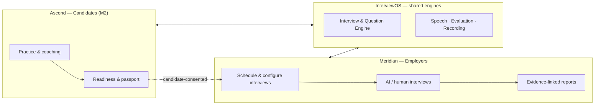
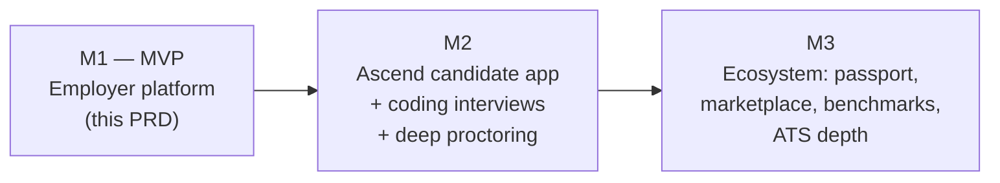
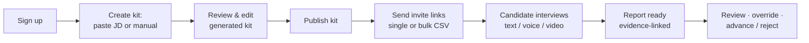
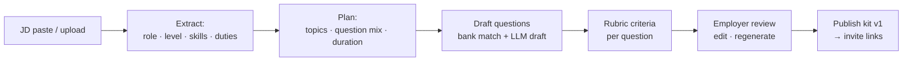
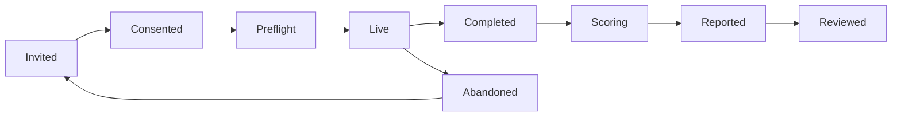
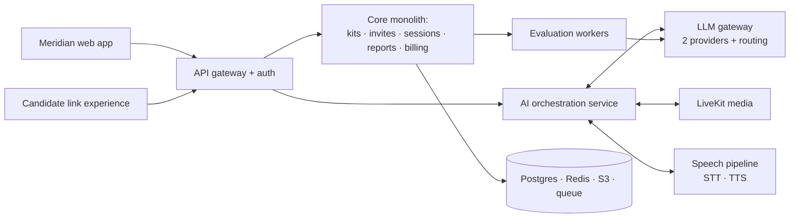

# AI Interview Ecosystem — Product Requirements Document

**Vision & Milestone 1 (MVP): Employer Interview Platform**
**Working names: `InterviewOS` (shared platform) · `Meridian` (employer product, MVP) · `Ascend` (candidate product, M2)**
**Version 1.0 · July 2026 · Status: Approved for build planning**
**Companion document: _AI Interview Ecosystem — Product & Engineering Blueprint v1.0_ (architecture depth lives there; this PRD governs scope)**

---

## 1. Purpose of this document

This PRD does two jobs. First, it restates the **whole product vision** — two products on one shared AI platform — so every contributor knows what the company is ultimately building. Second, it defines **Milestone 1 (MVP)** with buildable precision: the employer-facing interview platform where an employer schedules interviews, configures questions/topics/types/follow-ups (or generates the whole interview from a JD), sends the candidate a link, and receives an evidence-linked evaluation report after the candidate completes an AI-conducted (text, voice, or video) or human-facilitated, optionally proctored interview.

**Sequencing change from the Blueprint.** The Blueprint recommended launching the candidate product (Ascend) first. This PRD supersedes that sequencing: **the employer platform (Meridian) ships first**, because (a) the team already operates a product in this market and this MVP acts as a **validation layer** for it — verifying its candidates through structured AI interviews and returning results to it via API — and (b) employer revenue and real interview data arrive earlier. Ascend still ships in M2 and will reuse every engine built here; nothing in this MVP is built as a throwaway.

**Stated assumptions (cheap to correct, flagged once here):**

- _A1 — Validation layer meaning:_ the existing product pushes candidates (with a JD or role context) to this platform via API; the platform conducts/hosts the interview and returns structured results (scorecard + evidence) via webhook. The MVP also validates market demand for the ecosystem itself.
- _A2 — Team & window:_ 2–4 engineers, 8–10 weeks to pilot-ready. Scope is cut to fit; §15 marks what moves if the team is smaller.
- _A3 — Launch market:_ India-first; DPDP Act compliance baseline; English UI with Hindi/Hinglish-tolerant voice interviews.

---

## 2. The whole vision (what we are building over time)

### 2.1 One platform, two products

**Meridian (this MVP):** employers create interviews manually or from a JD, choose modes (text / voice / video), choose conductors (AI or human-facilitated), add proctoring, send links, and get structured, evidence-linked evaluations. **Ascend (M2):** candidates practice against the same Interview Engine with the same evaluation rigor — the employer product's rubrics make practice realistic, and practice produces better-prepared candidates for employers. **The flywheel (M3+):** consented, verified interview credentials begin to substitute for first-round screens.

### 2.2 Milestone roadmap

| Milestone               | Product surface                              | Key capabilities                                                                                                                                                                                                                      | Depends on |
| ----------------------- | -------------------------------------------- | ------------------------------------------------------------------------------------------------------------------------------------------------------------------------------------------------------------------------------------- | ---------- |
| **M1 — MVP (this PRD)** | Meridian web app + candidate link experience | Kit builder, JD generation, question bank + external-API adapter, invite links, text/voice/video AI interviews, human-facilitated live mode, baseline proctoring, evidence-linked reports, integration API + webhooks, credits wallet | —          |
| **M2**                  | Ascend PWA + Meridian depth                  | Candidate practice accounts, coaching feedback, readiness; coding-interview mode (IDE + tests); advanced proctoring (gaze, deepfake, device signals); Google/Outlook calendar sync; subscriptions                                     | M1 engines |
| **M3**                  | Both + platform                              | Skills passport + verification API, coach marketplace, cross-tenant benchmarks, ATS integrations (Zoho/Keka/Greenhouse), SSO/SCIM, Enterprise tier                                                                                    | M1+M2 data |

The Blueprint remains the reference architecture. Where this PRD is silent (e.g., long-term tenancy model, enterprise analytics), the Blueprint governs; where they conflict on sequencing, **this PRD wins**.

---

## 3. Milestone 1 — MVP definition

### 3.1 MVP goal (one sentence)

**Within 10 minutes of signing up, an employer can turn a JD (or a manual configuration) into a published, structured interview; send candidates a link; and — after the candidate completes a text, voice, live video, or async video interview conducted by AI (or facilitated by a human interviewer, with baseline proctoring) — receive, within 5 minutes, an evidence-linked evaluation report they can act on.**

### 3.2 What the MVP must prove (validation thesis)

1. **Employer value:** recruiters/founders will configure and trust AI-conducted interviews enough to send them to real candidates.
2. **Candidate feasibility:** real candidates on Indian networks/devices complete voice/video AI interviews at acceptable rates and without support tickets.
3. **Evaluation trust:** employers find reports credible enough to advance/reject on (measured via override and follow-through behavior, not surveys).
4. **Validation layer:** the existing product's candidates can be pushed, interviewed, and returned structured results programmatically — closing a verification loop that product cannot close today.
5. **Unit economics:** AI COGS per 15-minute voice interview at or below **₹30** (with a visible path to ₹15–20 per the Blueprint's cost ladder [^62^][^64^]).

### 3.3 MVP exit criteria (measurable "definition of done" for M1)

| #   | Criterion                                            | Target                                                                                               | How measured                                          |
| --- | ---------------------------------------------------- | ---------------------------------------------------------------------------------------------------- | ----------------------------------------------------- |
| X1  | Time from employer signup → published kit            | P50 ≤ 10 min                                                                                         | Product analytics funnel                              |
| X2  | JD-generated kits requiring ≤ 3 edits before publish | ≥ 70% of generations                                                                                 | Edit-diff tracking                                    |
| X3  | Invite-link → interview start rate                   | ≥ 70%                                                                                                | Funnel                                                |
| X4  | Start → completion rate (AI modes)                   | ≥ 85%                                                                                                | Session telemetry                                     |
| X5  | Report delivery after completion                     | P95 ≤ 5 min                                                                                          | Pipeline timing                                       |
| X6  | Voice turn latency (candidate stops → AI speaks)     | P50 ≤ 1.5 s, P95 ≤ 2.5 s                                                                             | Turn telemetry (Blueprint target 1.2 s arrives in M2) |
| X7  | AI COGS per 15-min voice interview                   | ≤ ₹30                                                                                                | Cost attribution jobs                                 |
| X8  | Compliance baseline                                  | 100% of sessions have recorded AI-use + recording consent before media capture                       | Consent registry audit                                |
| X9  | Pilot proof                                          | ≥ 3 pilot employers (incl. the existing product's candidate flow) complete ≥ 20 real interviews each | Pilot tracker                                         |
| X10 | Employer report trust                                | ≤ 30% of AI scores overridden; ≥ 60% of reports opened within 24 h                                   | Override + open telemetry                             |

### 3.4 Scope — IN (M1) vs OUT (deferred)

**IN scope is frozen at kickoff.** Anything not listed here is out.

| Epic                          | In scope (M1)                                                                                                                                                                                                                                                                         |
| ----------------------------- | ------------------------------------------------------------------------------------------------------------------------------------------------------------------------------------------------------------------------------------------------------------------------------------- |
| E1 Employer onboarding        | Email+OTP & Google login; org creation; two roles (Admin, Interviewer); single-org membership                                                                                                                                                                                         |
| E2 Interview Kit Builder      | Manual authoring of topics/questions; question types (§6.2); per-question follow-up policy, timers, difficulty, mandatory flags; kit settings (mode, language, proctoring level, intro/outro, logo); versioning; publish/archive; preview-as-candidate                                |
| E3 JD-based generation        | Paste/upload JD → role & skill extraction → full kit proposal (topics, questions, types, follow-ups, rubric) → edit → publish; per-question regenerate; kit preview                                                                                                                   |
| E4 Question sources           | Seeded internal question bank (role-family tagged); external-API adapter interface + one reference integration; source provenance on every question                                                                                                                                   |
| E5 Scheduling & invites       | Single + bulk (CSV) invite links; expiring, token-bound links; candidate identity capture (name, email, phone); optional OTP verification; automated reminders (email + WhatsApp); reschedule-by-link; .ics attachment for human-facilitated slots                                    |
| E6 Candidate experience       | Mobile-first web (no app install); preflight checks (mic/camera/network); AI-use + recording consent flow; practice question; all live AI modes + async video; session recovery on network drop; completion confirmation                                                              |
| E7 AI interviewer             | Follows kit structure; asks questions in configured modality; adaptive AI follow-ups where enabled (depth-capped); neutral, professional persona; per-question timers with grace; wrap-up + next-steps message                                                                        |
| E8 Human-facilitated mode     | Scheduled live video room (same link infra); kit on-screen with timers; structured scorecard; recording; AI assist OFF by default (transcription + auto-notes ON)                                                                                                                     |
| E9 Proctoring (baseline)      | Full-session recording; consent-gated webcam snapshots at random intervals (video mode); tab-switch / fullscreen-exit events (text mode); copy-paste capture in text answers; optional candidate ID upload at invite; integrity flags surfaced on report (flags, never auto-verdicts) |
| E10 Evaluation & report       | Full transcript; per-question rubric scores with evidence quotes; communication metrics (pace, fillers, structure); integrity flags panel; overall recommendation (5-point); human override with reason codes; PDF export; shareable read-only report link                            |
| E11 Notifications             | Employer: completion + report-ready. Candidate: invite, reminders, start confirmation. Channels: email + WhatsApp (SMS fallback)                                                                                                                                                      |
| E12 Dashboard (pipeline-lite) | Interview list with statuses (invited / started / completed / reviewed); candidate cards; kit-level stats; basic filters                                                                                                                                                              |
| E13 Integration API           | API keys; create-interview (from kit or inline JD); list/get results; scorecard JSON; webhooks (`interview.completed`, `report.ready`); sandbox environment                                                                                                                           |
| E14 Billing-lite              | Prepaid interview-credit wallet (per-mode pricing); low-balance alerts; usage ledger (no subscriptions in M1)                                                                                                                                                                         |
| E15 Async video interviews    | Role-based question selection; per-question video recording; transcription; employer review page; optional AI judge; evidence-linked report; credits: 3 per async-video session                                                                                                       |

**OUT of scope (explicit non-goals — defended in §14):**

| Out (M1)                                                            | Why deferred                                                                   | Lands in     |
| ------------------------------------------------------------------- | ------------------------------------------------------------------------------ | ------------ |
| Coding IDE interviews / auto-graded tests                           | Execution sandbox + judging is a subsystem of its own                          | M2           |
| Candidate accounts / practice app (Ascend)                          | Candidates are guests via magic links in M1                                    | M2           |
| Advanced proctoring (gaze, deepfake voice, liveness, second-device) | Needs vendor evals + consent/legal review; baseline signals suffice for pilots | M2           |
| Full ATS pipeline stages, offers, debrief workflows                 | MVP replaces "spreadsheet + WhatsApp," not the ATS                             | M3           |
| Calendar free/busy sync (Google/Outlook)                            | Manual slots + .ics suffice for pilots                                         | M2           |
| SSO/SCIM, multi-org, dedicated tenancy                              | Enterprise-tier features                                                       | M3           |
| Native mobile apps                                                  | PWA-first by design                                                            | M3 (if ever) |
| Subscriptions & invoicing                                           | Credits wallet proves willingness-to-pay faster                                | M2           |
| Vernacular UI                                                       | English UI; voice layer already tolerates Hindi/Hinglish answers               | M2           |
| Benchmarks, marketplace, passport                                   | Need data scale                                                                | M3           |

---

## 4. MVP personas

**P-A — "Recruiter at a growing company / staffing firm" (primary buyer).** Runs 50–500 screens/month; currently does telephonic screens or asks senior staff to take first rounds. Wants: paste JD, get a sensible interview, send 30 links, read ranked reports over morning coffee. Success for her: 80% of first-round human hours eliminated without candidate complaints.

**P-B — "Founder / hiring manager at a startup" (primary self-serve).** No HR team. Wants: "interview-in-a-box" for a role he's never hired for (e.g., first sales hire). JD generation and the question bank do the expertise lifting. Success: confident shortlist of 3 from 25 applicants in 48 hours.

**P-C — "Candidate" (guest).** Applied somewhere; receives a WhatsApp/email link. Skeptical of AI interviews (only 26% of candidates trust AI evaluation [^88^]); on a mid-tier Android over 4G. Success: clear disclosure, a practice question, no app install, no login friction, interview under 20 minutes, respectful experience even in rejection.

**P-D — "Interviewer (human-facilitated mode)".** A senior employee pulled into panels. Wants: the kit and timers on screen, no note-taking burden (auto-transcription/notes), a scorecard that takes 3 minutes.

**P-E — "Integration partner (our existing product)"** — programmatic user: pushes candidate + JD, receives scorecard webhooks. Success: zero-touch verification loop with ≤ 24 h turnaround SLA.

---

## 5. End-to-end user journeys

### 5.1 Employer journey (happy path)

### 5.2 Candidate journey (happy path)

Receives link (WhatsApp/email) → opens on phone browser → sees who is interviewing, why, and that AI/recording is used (consent, DPDP-grade notice [^50^]) → enters name/email/phone (+OTP if the employer enabled it) → preflight mic/camera/network check → optional practice question → interview in the configured mode → completion screen with what-happens-next. No password, no install, and the same link resumes a dropped session.

### 5.3 Human-facilitated journey

Employer schedules slot → candidate and interviewer(s) join the same room link at the time → kit with timers on the interviewer's screen → transcription + auto-notes run in the background → interviewer completes the structured scorecard (AI pre-fills from transcript where enabled) → report compiles and routes to the employer.

---

## 6. Functional requirements (by epic, with acceptance criteria)

Priority: **P0** = MVP cannot ship without it. **P1** = ship with it if the milestone plan holds; first to move if it slips. Requirement IDs (`FR-E#-#`) are stable for build tracking.

### E1 — Employer onboarding & org

| ID      | Requirement                                                                               | Pri | Acceptance criteria                                  |
| ------- | ----------------------------------------------------------------------------------------- | --- | ---------------------------------------------------- |
| FR-E1-1 | Email+OTP and Google sign-in; org auto-created on first login                             | P0  | Signup → org workspace in ≤ 2 min; no password flows |
| FR-E1-2 | Roles: Admin (everything incl. billing/API keys), Interviewer (kits, interviews, reports) | P0  | Role gates enforced server-side on all routes        |
| FR-E1-3 | Invite teammates by email                                                                 | P1  | Invite email → role-joined workspace                 |

### E2 — Interview Kit Builder

The kit is the central artifact: an ordered, versioned interview definition. An **interview kit** contains: metadata (title, role, level), global settings (mode, language, proctoring level, intro/outro text, employer logo, total time cap), a list of **topics**, and a list of **questions** mapped to topics.

| ID      | Requirement                                                                                                                                   | Pri | Acceptance criteria                                                                        |
| ------- | --------------------------------------------------------------------------------------------------------------------------------------------- | --- | ------------------------------------------------------------------------------------------ |
| FR-E2-1 | CRUD kits, topics, questions with drag-order                                                                                                  | P0  | All edits autosaved; kit unsaved-changes guard                                             |
| FR-E2-2 | Question types (§6.2): open-ended (text/voice/video answer), MCQ single & multi, rating scale                                                 | P0  | Each type renders correctly in its mode; MCQ auto-scored                                   |
| FR-E2-3 | Per-question config: topic, difficulty, time limit (soft/hard), mandatory flag, evaluation criteria (free-text rubric lines + weights)        | P0  | Config persisted in kit version; visible in preview                                        |
| FR-E2-4 | **Follow-up policy per question:** `none` · `fixed` (author-written follow-ups) · `adaptive_ai` (AI probes from the answer, depth-capped 1–3) | P0  | AI follow-ups reference the candidate's actual answer content ≥ 90% of the time (eval set) |
| FR-E2-5 | Kit versioning: publish creates immutable version; invites bind to a version; edits create a new draft                                        | P0  | Report always displays the exact kit version used                                          |
| FR-E2-6 | Preview-as-candidate (all modes, no recording/scoring)                                                                                        | P0  | Preview completes full flow without creating a session record                              |
| FR-E2-7 | Kit templates gallery (role-family starters)                                                                                                  | P1  | ≥ 10 templates at launch                                                                   |

### 6.2 Question type matrix (mode × type support)

| Question type      | Text mode | Voice mode    | Video mode       | Scored by                    |
| ------------------ | --------- | ------------- | ---------------- | ---------------------------- |
| Open-ended answer  | typed     | spoken        | spoken on camera | LLM rubric judges + evidence |
| MCQ (single/multi) | tap       | spoken option | spoken option    | Deterministic key match      |
| Rating scale (1–5) | tap       | spoken number | spoken number    | Deterministic                |
| (M2) Coding task   | IDE       | IDE + voice   | IDE + cam        | Test cases + judges          |

**Adaptive follow-ups** (type `adaptive_ai`) apply to open-ended questions only; MCQ/rating use `fixed` clarification follow-ups at most.

### E3 — JD-based interview generation

| ID      | Requirement                                                                                                                                                                                                                                                   | Pri | Acceptance criteria                                                     |
| ------- | ------------------------------------------------------------------------------------------------------------------------------------------------------------------------------------------------------------------------------------------------------------- | --- | ----------------------------------------------------------------------- |
| FR-E3-1 | JD intake: paste text or upload PDF/DOCX                                                                                                                                                                                                                      | P0  | Extraction succeeds on ≥ 95% of real JDs (test corpus)                  |
| FR-E3-2 | JD analysis → role title, seniority, must-have vs nice-to-have skills, responsibilities, tool/tech stack, language requirements                                                                                                                               | P0  | Structured extraction validated against gold set (≥ 90% field accuracy) |
| FR-E3-3 | Kit proposal: 4–8 topics; 8–15 questions across behavioral / situational / technical / screening; per-question type suggestion; follow-up policy defaults (adaptive on open-ended); rubric criteria per question; total duration estimate (default 15–20 min) | P0  | ≥ 70% of proposals published with ≤ 3 edits (exit criterion X2)         |
| FR-E3-4 | Per-question "regenerate" and "generate more like this"                                                                                                                                                                                                       | P0  | Regeneration respects topic and type constraints                        |
| FR-E3-5 | Employer edits everything before publish (generation proposes, human disposes)                                                                                                                                                                                | P0  | No path to publish without human review screen                          |
| FR-E3-6 | Generation auditability: prompt version + JD hash stored on kit                                                                                                                                                                                               | P1  | Reproducible generation for support/disputes                            |

### E4 — Question sources

| ID      | Requirement                                                                                                                  | Pri | Acceptance criteria                                                              |
| ------- | ---------------------------------------------------------------------------------------------------------------------------- | --- | -------------------------------------------------------------------------------- |
| FR-E4-1 | Internal question bank: ≥ 500 seeded questions, tagged by role family / topic / difficulty / type, each with rubric criteria | P0  | Bank searchable inside kit builder; insert in ≤ 3 clicks                         |
| FR-E4-2 | External-API adapter interface: `searchQuestions(query) → normalized question[]` with auth config per org                    | P1  | One reference integration live; failures degrade gracefully to bank + generation |
| FR-E4-3 | Source provenance on every question (manual / jd_generated / bank / external_api + ref)                                      | P0  | Provenance visible in kit and stored in session record                           |

### E5 — Scheduling & invite links

| ID      | Requirement                                                                                                                      | Pri | Acceptance criteria                                                                              |
| ------- | -------------------------------------------------------------------------------------------------------------------------------- | --- | ------------------------------------------------------------------------------------------------ |
| FR-E5-1 | Generate invite links: single candidate (name/email/phone) or bulk CSV upload (≥ 500 rows)                                       | P0  | Each link is a unique, unguessable, single-candidate token; expiry configurable (default 7 days) |
| FR-E5-2 | Link security: token-bound; optional candidate OTP verification at open; one active session per link; completed links tombstoned | P0  | Shared/leaked link cannot be reused post-completion; security review sign-off                    |
| FR-E5-3 | Reminders: automatic at T-48h/T-4h (configurable), email + WhatsApp                                                              | P0  | Reminder lift measurable; unsubscribe honored                                                    |
| FR-E5-4 | Reschedule/reopen: employer can extend expiry or reissue; candidate-facing reschedule request for human-facilitated slots        | P0  | No dead ends in candidate flow                                                                   |
| FR-E5-5 | Human-facilitated scheduling: slot picker, interviewer assignment, .ics invites                                                  | P0  | Room link activates ±10 min of slot                                                              |

### E6 — Candidate interview experience

| ID      | Requirement                                                                                                                                                      | Pri | Acceptance criteria                                            |
| ------- | ---------------------------------------------------------------------------------------------------------------------------------------------------------------- | --- | -------------------------------------------------------------- |
| FR-E6-1 | Mobile-first browser experience; no install; works on 4G and ₹10–15K Android devices                                                                             | P0  | Lighthouse perf ≥ 85 on Moto G-class; X4 completion target met |
| FR-E6-2 | Pre-interview disclosure + consent: AI use, recording, what's measured, retention, rights (DPDP notice [^50^]); consent artifact stored before any media capture | P0  | X8: 100% sessions have consent record; withdrawal path shown   |
| FR-E6-3 | Identity capture: name/email/phone prefilled from invite; optional OTP                                                                                           | P0  | Identity bound to session                                      |
| FR-E6-4 | Preflight: mic/cam permissions, network test, speaker test; graceful fallback voice→text on failure                                                              | P0  | Fallback preserves session state                               |
| FR-E6-5 | One practice question (unscored) before the real interview                                                                                                       | P1  | Marked clearly as practice                                     |
| FR-E6-6 | Session recovery: network drop → local buffering → resume via same link; partial progress kept                                                                   | P0  | Kill-network-mid-interview test recovers ≤ 10 s                |
| FR-E6-7 | Post-interview: thank-you, what-happens-next, optional feedback emoji + comment                                                                                  | P1  | Candidate NPS collectible                                      |

### E7 — AI interviewer

| ID      | Requirement                                                                                                                                                                   | Pri | Acceptance criteria                                        |
| ------- | ----------------------------------------------------------------------------------------------------------------------------------------------------------------------------- | --- | ---------------------------------------------------------- |
| FR-E7-1 | Conducts the kit in order; introduces self as AI; asks one question at a time; respects per-question timers with grace                                                        | P0  | 100% kit fidelity (no skipped mandatory questions)         |
| FR-E7-2 | Adaptive follow-ups (where enabled): probe specifics, request examples, resolve contradictions; depth cap respected                                                           | P0  | Follow-up relevance ≥ 90% on eval set; never exceeds cap   |
| FR-E7-3 | Voice mode: natural turn-taking, barge-in support, backchannels; Hinglish-mixed speech handled [^64^]                                                                         | P0  | X6 latency targets; code-switch eval set WER within budget |
| FR-E7-4 | Guardrails: stays on interview topics; declines coaching/answers leakage, protected-characteristic probing, and prompt-injection attempts (candidate text is untrusted input) | P0  | Red-team suite passes on release candidate                 |
| FR-E7-5 | Graceful degradation: TTS failure → text + STT continues; STT failure → text mode; total AI failure → pause + resume offer + employer alert                                   | P0  | No dead sessions from single-component failure             |
| FR-E7-6 | Wrap-up: thanks, next steps, expected timeline placeholder from kit outro                                                                                                     | P0  | Consistent closing on 100% of completions                  |

### E8 — Human-facilitated mode

| ID      | Requirement                                                                                                                              | Pri | Acceptance criteria                                 |
| ------- | ---------------------------------------------------------------------------------------------------------------------------------------- | --- | --------------------------------------------------- |
| FR-E8-1 | Live video room (same LiveKit infra as AI video mode) for 1 candidate + 1–3 interviewers                                                 | P0  | Join ≤ 10 s; recording with consent banner          |
| FR-E8-2 | Interviewer cockpit: kit questions + suggested follow-ups + timers on screen; mark covered/Skip                                          | P0  | Coverage tracked per question                       |
| FR-E8-3 | Live transcription + auto-notes (summary + question-wise mapping) post-call                                                              | P0  | Notes available ≤ 2 min after end                   |
| FR-E8-4 | Structured scorecard (kit rubric), AI pre-fill from transcript with evidence (editable)                                                  | P1  | Pre-fill acceptance/edit tracked (feeds eval loop)  |
| FR-E8-5 | AI assist is OFF by default; if enabled, limited to transcription, notes, coverage reminders — never live answer scoring during the call | P0  | Policy enforced in product; documented to employers |

### E9 — Proctoring (baseline)

| ID      | Requirement                                                                                                                                                 | Pri | Acceptance criteria                                  |
| ------- | ----------------------------------------------------------------------------------------------------------------------------------------------------------- | --- | ---------------------------------------------------- |
| FR-E9-1 | Proctoring level per kit: `none` / `standard` (recording + event signals) / `strict` (standard + snapshots + ID upload)                                     | P0  | Level disclosed in candidate consent screen verbatim |
| FR-E9-2 | Signals: random webcam snapshots (video), tab-switch/fullscreen-exit count (text), copy-paste events in text answers, long-silence/background-voice markers | P0  | All signals timestamped on session timeline          |
| FR-E9-3 | Integrity flags → report panel with evidence links; **flags are never auto-rejections**; human dispositions with reason codes                               | P0  | Zero auto-reject paths exist in code (review item)   |
| FR-E9-4 | Optional candidate ID upload at invite (image; stored encrypted, PII-segregated)                                                                            | P1  | Retention schedule applies; deletable on request     |

### E10 — Evaluation & report

| ID       | Requirement                                                                                                                                                                                                                                                        | Pri         | Acceptance criteria                                                                |
| -------- | ------------------------------------------------------------------------------------------------------------------------------------------------------------------------------------------------------------------------------------------------------------------ | ----------- | ---------------------------------------------------------------------------------- |
| FR-E10-1 | Report: candidate header, kit version, transcript, per-question rubric scores (criteria-level) with **evidence quotes** from transcript, communication metrics (pace, fillers, structure, listening), integrity panel, overall 5-point recommendation + confidence | P0          | Every score cites ≥ 1 transcript span; ungrounded scores rejected by schema        |
| FR-E10-2 | Report delivered P95 ≤ 5 min (X5); employer notified                                                                                                                                                                                                               | P0          | Pipeline timing dashboards                                                         |
| FR-E10-3 | Human override on any score with mandatory reason code; original + override both preserved (audit)                                                                                                                                                                 | P0          | Override rate feeds X10 and the AI quality loop                                    |
| FR-E10-4 | PDF export + read-only share link (expiring)                                                                                                                                                                                                                       | P1          | Share link access logged                                                           |
| FR-E10-5 | Candidate comparison view (per kit): side-by-side scores + evidence                                                                                                                                                                                                | P1 → **M2** | Deferred to M2 to make room for E15; see §14                                       |
| FR-E10-6 | Async video scorecard: employer review page + optional AI judge pre-fill produce the same evidence-linked scores and recommendation as live modes                                                                                                                  | P0          | Async video reports match live-mode report schema; pre-fill cites transcript spans |

### E11 — Notifications

| ID       | Requirement                                                                                                                 | Pri | Acceptance criteria                                            |
| -------- | --------------------------------------------------------------------------------------------------------------------------- | --- | -------------------------------------------------------------- |
| FR-E11-1 | Template service with per-event toggles: invite, reminder, nudge-incomplete, completion (employer), report-ready (employer) | P0  | All events deliver ≤ 1 min                                     |
| FR-E11-2 | Channels: email (transactional), WhatsApp Business API, SMS fallback                                                        | P0  | WhatsApp templates approved before pilot (lead-time risk, §13) |
| FR-E11-3 | Consent-aware: candidate marketing opt-in separate from transactional                                                       | P0  | DPDP consent registry records channel consents                 |

### E12 — Dashboard (pipeline-lite)

| ID       | Requirement                                                                          | Pri | Acceptance criteria              |
| -------- | ------------------------------------------------------------------------------------ | --- | -------------------------------- |
| FR-E12-1 | Interview table: candidate, kit, mode, status, score, flags, dates; filters + search | P0  | 5K sessions/org performant       |
| FR-E12-2 | Candidate detail: timeline (invite → consent → session → report), all artifacts      | P0  | Single URL per candidate per kit |
| FR-E12-3 | Kit-level stats: invites, starts, completions, avg score, drop-off points            | P1  | Per-question drop-off visible    |

### E13 — Integration API (validation layer for the existing product)

| ID       | Requirement                                                                                                                                        | Pri                                                                                                                                                       | Acceptance criteria                                                    |
| -------- | -------------------------------------------------------------------------------------------------------------------------------------------------- | --------------------------------------------------------------------------------------------------------------------------------------------------------- | ---------------------------------------------------------------------- |
| FR-E13-1 | Org API keys (test/live), scoped, rotatable                                                                                                        | P0                                                                                                                                                        | Key auth on all v1 routes; rate-limited                                |
| FR-E13-2 | `POST /v1/interviews` — body: `{ kit_id                                                                                                            | jd_text, candidate {name, email, phone, external_ref}, mode, proctoring_level, callback_url, send_invite: bool }`→ returns`{ interview_id, invite_link }` | P0                                                                     | Idempotent on external_ref+kit; link works out-of-band |
| FR-E13-3 | `GET /v1/interviews/{id}` → status; `GET /v1/interviews/{id}/scorecard` → full structured JSON (scores, evidence, flags, recommendation, versions) | P0                                                                                                                                                        | Scorecard schema versioned; matches web report                         |
| FR-E13-4 | Webhooks: `interview.completed`, `report.ready`, signed (HMAC), retried with backoff, replayable                                                   | P0                                                                                                                                                        | Delivery ≥ 99.5% within 1 min (after retries)                          |
| FR-E13-5 | Sandbox keys + seed data + docs page                                                                                                               | P1                                                                                                                                                        | Partner (existing product) integrates without our help in ≤ 2 dev-days |

**Validation-layer loop (assumption A1 made concrete):** existing product calls FR-E13-2 with its candidate + role context → we send/host the interview → FR-E13-4 webhook → it ingests the scorecard as a verified signal on its own candidate records. Turnaround ≤ 24 h SLA tracked as a first-class metric (§12).

### E14 — Billing-lite

| ID       | Requirement                                                                                                                                                 | Pri | Acceptance criteria                                   |
| -------- | ----------------------------------------------------------------------------------------------------------------------------------------------------------- | --- | ----------------------------------------------------- |
| FR-E14-1 | Prepaid credit wallet: credits per mode (text = 1, voice = 2, video = 3 credits; human-facilitated = 1); debit on interview start, refund on system-failure | P0  | Ledger accurate to the credit; concurrency-safe debit |
| FR-E14-2 | Low-balance alerts + blocked-at-zero with grace for in-flight sessions                                                                                      | P0  | No interrupted interviews due to billing              |
| FR-E14-3 | Pilot plan: manual credit grants by us (no payment gateway required to start pilots)                                                                        | P0  | Payment integration (Razorpay) behind flag            |

### E15 — Async video interviews

Async video lets candidates record answers to each question on their own time, without a live AI or human conductor. It is treated as a first-class M1 mode for role-based screening at scale.

| ID        | Requirement                                                                                                                                                                                                                                                           | Pri | Acceptance criteria                                                                                                                                     |
| --------- | --------------------------------------------------------------------------------------------------------------------------------------------------------------------------------------------------------------------------------------------------------------------- | --- | ------------------------------------------------------------------------------------------------------------------------------------------------------- |
| FR-E15-1  | Interview creation from role: `POST /async-video-interviews` accepts `role_id` (or `role_name`), `candidate` (name/email/phone/external_ref), optional `org_id`, optional `expires_at` (default 6 months), optional `max_duration_seconds` per answer (default 180 s) | P0  | Creates candidate (or reuses existing by email), publishes invite link, returns `{ interview_id, invite_link }`; idempotent on `external_ref`+`role_id` |
| FR-E15-2  | Question selection: picks the current published question set for the role; if no role set exists, falls back to kit builder selection or a 400 error with a clear message                                                                                             | P0  | Every created async-video session has a deterministic question list stored on first open                                                                |
| FR-E15-3  | Candidate flow: consent → preflight (mic/camera/network) → one question at a time → record → review/re-record → submit → next; cannot submit interview until every question has an answer                                                                             | P0  | Completion only after all questions answered; unanswered questions block submission and show clear CTAs                                                 |
| FR-E15-4  | Per-question video capture: browser MediaRecorder to WebM; upload to S3/MinIO with key `async-video/{sessionId}/{questionId}/{timestamp}.webm`; storage event written to session media refs                                                                           | P0  | Upload succeeds on 4G; failed uploads retry once and surface a recoverable error                                                                        |
| FR-E15-5  | Transcription pipeline: extract audio with ffmpeg, route to `SttPort` (mock today, real adapter later); run in BullMQ worker with retries + DLQ; transcript stored per answer and surfaced on review page                                                             | P0  | `transcription_job` created per answer; completed/failed state visible; DLQ on hard failure                                                             |
| FR-E15-6  | Employer review page: list questions, play videos inline, view transcript, enter per-question score + remarks, submit scorecard                                                                                                                                       | P0  | Review page loads ≤ 3 s for 5-question interviews; scores persisted with audit                                                                          |
| FR-E15-7  | Optional AI judge: when enabled, call the same judge port used for live modes to pre-fill per-question scores and evidence from transcript; human reviewer can edit before submit                                                                                     | P1  | Pre-fill completes ≤ 2 min after transcription; every pre-filled score cites a transcript span                                                          |
| FR-E15-8  | Report generation: after scorecard submit, produce the same evidence-linked report format as live modes (header, kit/question list, scores, communication metrics, integrity panel, recommendation)                                                                   | P0  | Report schema matches live-mode report; share link + PDF export work                                                                                    |
| FR-E15-9  | Credits: async video debits 3 credits on interview creation (same as live video); no refund after first answer is uploaded                                                                                                                                            | P0  | Ledger accurate; concurrency-safe debit                                                                                                                 |
| FR-E15-10 | Proctoring baseline: standard-level recording only; no snapshots, no tab-switch detection (candidate is not in a live browser test)                                                                                                                                   | P0  | Proctoring level disclosed as `none` or `recording-only` in consent; integrity panel shows recording confirmation only                                  |

**Scope trade:** E15 is added to M1 to close the validation-layer use case (existing product pushes candidates by role). To keep M1 scope frozen, **FR-E10-5 candidate comparison view is deferred to M2**.

---

## 7. Interview modes — specification

|                    | **Text (AI)**                                | **Voice (AI)**                   | **Video (AI)**                       | **Async video**             | **Human-facilitated**              |
| ------------------ | -------------------------------------------- | -------------------------------- | ------------------------------------ | --------------------------- | ---------------------------------- |
| Channel            | Chat UI                                      | WebRTC audio                     | WebRTC audio+camera                  | Browser MediaRecorder       | Live video room                    |
| Conductor          | AI                                           | AI                               | AI                                   | None (self-recorded)        | Human (kit-guided)                 |
| Follow-ups         | Fixed or adaptive                            | Fixed or adaptive                | Fixed or adaptive                    | None                        | Human judgment (+ kit suggestions) |
| Recording          | Transcript                                   | Audio + transcript               | AV + snapshots + transcript          | AV per answer + transcript  | AV + transcript                    |
| Proctoring signals | Tab/fullscreen events, paste events          | Audio events, silence markers    | Snapshots, all voice signals         | Recording confirmation only | Human observation + recording      |
| Best for           | Low bandwidth, screening at scale, MCQ-heavy | Default India-first depth screen | Higher-stakes or client-facing roles | High-volume async screening | Final rounds, senior roles         |
| COGS/class         | 1 credit                                     | 2 credits                        | 3 credits                            | 3 credits                   | 1 credit                           |

Mode is chosen **per kit** for live AI modes and **per async-video session** for async video (all questions in one mode for comparability in M1; mixed-mode kits arrive in M2). Video-ON is **off by default** for live AI modes — employer consciously enables it (candidate bandwidth + comfort; AI-conducted video adds cost without scoring value in M1, since we do no face-based analysis — and never will, per the Blueprint's no-emotion-recognition policy [^48^]). Async video always requires camera and microphone.

---

## 8. JD → interview generation flow (detail)

Design rules: generation is **retrieval-first** (match bank questions to extracted topics, then LLM-draft gaps — cheaper and more controllable than pure generation); every generated question carries its rubric criteria; the employer **must** pass through a review screen before publishing (human-in-the-loop by design, and our EU-AI-Act-consistent posture [^49^]); total duration estimator keeps kits within the configured cap by dropping/merging lowest-priority topics with employer confirmation.

---

## 9. MVP data model (core entities)

| Entity                                        | Key fields (abridged)                                                                                                                              | Notes                                                            |
| --------------------------------------------- | -------------------------------------------------------------------------------------------------------------------------------------------------- | ---------------------------------------------------------------- |
| `org`                                         | id, name, plan, credits_balance, api_keys[]                                                                                                        | Single-org membership in M1                                      |
| `user`                                        | id, org_id, role(admin/interviewer), contact                                                                                                       | OTP/Google identities                                            |
| `kit` / `kit_version`                         | id, org_id, title, role, settings{mode, language, proctoring_level, branding}, jd_ref?, status                                                     | Immutable versions; invites bind to version                      |
| `question`                                    | kit_version_id, topic, type, prompt, options[], difficulty, time_limit, mandatory, followup_policy, rubric_lines[], source, source_ref             | §6.2 types                                                       |
| `question_bank_item`                          | role_family, topic, type, difficulty, prompt, rubric_lines                                                                                         | Seeded ≥ 500                                                     |
| `candidate`                                   | id, org_id, name, email, phone, external_ref, pii_vault_ref                                                                                        | external_ref = existing-product linkage                          |
| `invite`                                      | id, kit_version_id, candidate_id, token_hash, expires_at, otp_required, status                                                                     | Token stored hashed                                              |
| `interview_session`                           | id, invite_id, mode, conductor(ai/human), status, consent_id, preflight_report, started/ended_at, media_refs[], integrity_events[], schema_version | State machine §10                                                |
| `evaluation`                                  | session_id, rubric_version, scores[{criteria, score, evidence_span_ids[]}], comm_metrics, recommendation, confidence, model_route, prompt_versions | Evidence-linked, §E10                                            |
| `override`                                    | evaluation_id, user_id, field, old, new, reason_code                                                                                               | Audit trail                                                      |
| `consent_record`                              | subject_id, notice_version, purpose, captured_at, artifact_uri                                                                                     | DPDP-grade [^50^]                                                |
| `credit_ledger`                               | org_id, delta, reason, session_ref, balance_after                                                                                                  | Wallet                                                           |
| `webhook_endpoint` / `webhook_delivery`       | org_id, url, secret, event, status, attempts                                                                                                       | HMAC-signed                                                      |
| `role_based_questions`                        | role_name, question_number, difficulty_level, question_type, question_text, experience_target                                                      | Imported question set for async video; versioned by import batch |
| `async_video_review_score`                    | session_id, question_id, scores[], remarks, reviewer_id, submitted_at                                                                              | Per-question human review scores for async video                 |
| `transcription_job` / `transcription_job_dlq` | session_id, question_id, media_ref, status, result, attempts, error                                                                                | BullMQ-backed audio extraction + STT; DLQ for hard failures      |

---

## 10. Session state machine (M1)

Every transition emits an analytics event and (for subscribed orgs) a webhook. `Abandoned → Invited` triggers the nudge sequence — show-rate is a core employer metric (§12). For async video, `Live` means the candidate is actively recording answers (not a real-time room); `Completed` is reached only after all questions are answered and the final submission is received.

---

## 11. MVP architecture (built as shared components)

**Built now, product-agnostic (Ascend reuses in M2):** identity/consent, Interview Engine (session orchestration), Question Engine (kit + bank + generation), Speech Pipeline, Evaluation Engine, Recording service, Notification service, Report renderer, LLM gateway. **Meridian-only:** kit builder UI, dashboard, billing wallet, API keys. **Ascend-only (M2):** accounts, coaching, readiness. Stack per the Blueprint: TypeScript/NestJS core, Python AI workers, Postgres, Redis, LiveKit, S3-compatible storage; LLM gateway with two live providers and task-based routing (Flash-class models default [^62^], provider STT/TTS [^64^]); single region (India) + daily DR backups in M1.

---

## 12. Success metrics & analytics plan

| Layer               | Metric                                              | Target (pilot exit)                                |
| ------------------- | --------------------------------------------------- | -------------------------------------------------- |
| Activation          | Signup → published kit                              | P50 ≤ 10 min (X1)                                  |
| Generation quality  | Kits published with ≤ 3 edits                       | ≥ 70% (X2)                                         |
| Funnel              | Invite → start ≥ 70%; start → complete ≥ 85%        | X3, X4                                             |
| Experience          | Voice turn latency P50                              | ≤ 1.5 s (X6)                                       |
| Economics           | AI COGS per 15-min voice interview                  | ≤ ₹30 (X7)                                         |
| Trust               | Score override rate ≤ 30%; report open ≤ 24 h ≥ 60% | X10                                                |
| Validation layer    | Existing-product interviews via API; turnaround     | ≥ 100 sessions; ≤ 24 h P95                         |
| Pilot health        | Weekly active pilot employers; interviews/week      | ≥ 3 orgs; ≥ 60/wk aggregate                        |
| Candidate sentiment | Post-interview NPS                                  | ≥ +20 (watch item, AI-interview skepticism [^88^]) |

Instrumentation: event taxonomy defined at build start (`invite.sent/opened/started`, `turn.latency`, `session.completed`, `report.viewed`, `score.overridden`, `credits.depleted`); every event carries org, kit version, mode, and cost attribution.

---

## 13. Compliance, consent & trust baseline (M1)

Non-negotiables at pilot: AI-use + recording disclosure with stored consent artifacts before capture (X8); DPDP-grade notice, purpose limitation, withdrawal path, and 72-hour breach runbook [^50^]; proctoring level disclosed verbatim in consent text; **flags never auto-reject** (human dispositions only); retention defaults (media 12 months, configurable downward; erasure on request); encrypted PII vault for contact data and IDs; no face/emotion/personality analysis ever [^48^]. WhatsApp Business API template approval and Razorpay KYC are **lead-time items — start in week 1**. LL144-style artifacts (bias-audit export) are M2, but every score's evidence-linking (FR-E10-1) is already the substrate such audits require [^41^].

---

## 14. Non-goals & scope-creep defense (M1)

The Out list in §3.4 is binding. Rationale for the three most-tempting additions: **coding interviews** — the sandbox/judge subsystem would consume ~3 weeks alone and pilots don't require it to prove the thesis; **candidate accounts** — guest links prove employer value first, and M2's Ascend will absorb candidate identity with far better UX than a bolted-on login; **deep proctoring** — baseline signals + human review prove the workflow while vendor/deepfake detection (and its consent law matrix, e.g., Illinois-style disclosure [^52^]) gets proper evaluation in M2. Any addition to M1 scope requires trading something out of equal size, in writing, in this document.

**Scope trade executed:** E15 — Async video interviews was added to M1 to close the validation-layer use case (API-driven, role-based screening). To keep total M1 scope frozen, **FR-E10-5 candidate comparison view is deferred from M1 to M2**. Async video reuses the existing judge port, report renderer, storage, and transcription worker; it does not introduce new vendor integrations.

---

## 15. Release plan (8–10 weeks, 2–4 engineers)

| Weeks | Track A (platform)                                                                                                     | Track B (experience)                                                     | Gate at end of week                                           |
| ----- | ---------------------------------------------------------------------------------------------------------------------- | ------------------------------------------------------------------------ | ------------------------------------------------------------- |
| W1–2  | Auth/orgs, DB + kit/question schema, question bank seed, CI/CD, environments, WhatsApp/Razorpay applications           | Kit builder UI v1 (manual authoring)                                     | Kit CRUD end-to-end in staging                                |
| W3–4  | JD generation pipeline, invite/token service, notification service                                                     | Candidate text mode end-to-end; report v1 (text)                         | **MVP-0 demo: JD → link → text interview → report**           |
| W5–6  | AI orchestration + speech pipeline (STT/TTS), LiveKit integration, recording                                           | Voice mode; preflight + fallback paths                                   | Voice interview completes on 4G; latency ≤ X6                 |
| W7    | Video mode, snapshots, integrity events, consent hardening                                                             | Video mode UI; proctoring panel on report                                | Strict-level interview with flags visible                     |
| W8    | Human-facilitated room, cockpit, scorecard, auto-notes; async video transcription worker + review page                 | Employer dashboard polish, PDF export; async video candidate flow polish | Human-facilitated interview end-to-end; async video E2E green |
| W9    | Integration API + webhooks + sandbox; credits wallet (including async-video debit); cost/latency tuning; red-team pass | Candidate flow polish; async video judge pre-fill                        | X-criteria dry-run on staging data                            |
| W10   | Pilot runbooks, support tooling, legal copy final, load test (target: 500 concurrent voice sessions)                   | Bug buffer                                                               | **Pilot gate: X1–X8 verified; 3 pilots onboard**              |

If the team is 1–2 engineers: cut FR-E8 (human-facilitated) to pilot-with-manual-workaround, defer E4-2 and E14-3's Razorpay flag, and target 12–14 weeks — the PRD's P0 set otherwise holds.

---

## 16. Risks (M1-specific)

| #     | Risk                                                       | Likelihood | Mitigation                                                                                                    |
| ----- | ---------------------------------------------------------- | ---------- | ------------------------------------------------------------------------------------------------------------- |
| M1-R1 | Voice latency/naturalness disappoints on real 4G           | High       | Audio-first design, streaming pipeline, text fallback; X6 measured from W6 with pilot devices                 |
| M1-R2 | JD generation quality variance across roles                | Medium     | Retrieval-first generation, mandatory review screen, X2 tracking, per-question regenerate                     |
| M1-R3 | Invite-link leakage/sharing                                | Medium     | Token binding, OTP option, completion tombstoning, anomaly alerts (many opens, many devices)                  |
| M1-R4 | Candidate distrust of AI interviewer suppresses completion | Medium     | Transparent disclosure, practice question, humane tone, fallback to human-facilitated for senior roles [^88^] |
| M1-R5 | Proctoring false positives poison employer trust           | Medium     | Flags + evidence, never verdicts; weekly false-positive review during pilots                                  |
| M1-R6 | WhatsApp/payment approval delays block pilots              | Medium     | Week-1 applications; email/SMS-only pilot path exists                                                         |
| M1-R7 | AI COGS overshoot on long-winded candidates                | Low-Med    | Turn/time caps, wallet ceilings, gateway budget breakers (Blueprint §10.2 [^62^])                             |
| M1-R8 | Scope creep into coding/accounts                           | High       | §14 defense; M2 roadmap is the parking lot                                                                    |

---

## 17. Open questions (M1)

1. **Pilot pricing:** free credits then paid, or paid from day one? _Recommend:_ 25 free credits/org during pilot, paid packs immediately after — willingness-to-pay data starts early.
2. **Candidate OTP on by default?** _Recommend:_ employer-optional, default off for friction, default on for strict proctoring kits.
3. **External question-API partner:** build the adapter against a real partner now or stub? _Recommend:_ adapter interface + stub in M1; real partner when a pilot demands it.
4. **Video default:** confirmed OFF by default (bandwidth + candidate comfort); revisit after pilot data.
5. **Report sharing with candidates:** employer opt-in per kit in M2; never default-on.
6. **Human-facilitated calendar sync:** manual slots + .ics in M1; Google/Outlook free/busy in M2 (P1 if a pilot blocks on it).
7. **Async video AI judge default:** should AI pre-fill be on by default for async video, or employer-opt-in per session? _Recommend:_ opt-in per session during pilot to build trust in human review first; default-on after override rate drops below 20%.

---

## Footnotes

[^41^]: https://employsome.com/hire/united-states/nyc-local-law-144/

[^48^]: https://decodethefuture.org/en/eu-ai-act-explained/

[^49^]: https://ajelix.com/ai/eu-ai-act/

[^50^]: https://www.seclore.com/fundamentals/dpdp-rules-2025-compliance-guide/

[^52^]: https://www.hr.uillinois.edu/policy/a_i_guidelines_for_hiring_and_employment

[^62^]: https://costgoat.com/pricing/gemini-api

[^64^]: https://www.gladia.io/blog/deepgram-pricing

[^88^]: https://www.gartner.com/en/newsroom/press-releases/2025-07-31-gartner-survey-shows-just-26-percent-of-job-applicants-trust-ai-will-fairly-evaluate-them

_Internal note: section references of the form "Blueprint §x.y" point to the companion document, AI Interview Ecosystem — Product & Engineering Blueprint v1.0._
