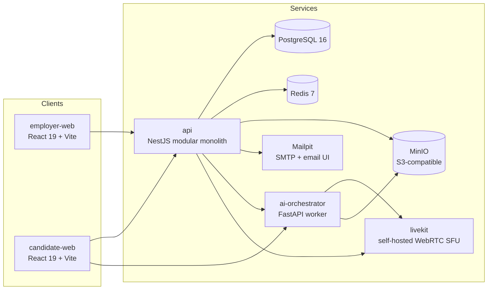

# Architecture — InterviewOS / Meridian MVP

**Version:** 1.0 · **Status:** Phases 00–09 complete (mock-credential mode) · **Companion:** `docs/AI Interview Ecosystem Blueprint.md`

This document describes the _implemented_ architecture of the M1 MVP, not the long-term vision. Where the Blueprint is broader, this file reflects what is actually in `main` today.

---

## 1. System overview



- **Two SPAs** (React 19, TypeScript strict, Vite 7, Tailwind 4, `@zios/ui` design system) — employer and candidate experiences.
- **NestJS modular monolith** (`services/api`) — all bounded contexts behind Nest modules with module-boundary lint rules; single process in dev, horizontally scalable in prod.
- **FastAI orchestrator** (`services/ai-orchestrator`) — Python worker for AI-heavy hot paths (voice turns, future LLM/STT/TTS adapters) that must scale independently of the API.
- **Self-hosted LiveKit** — real WebRTC media plane for voice/video/human-facilitated interviews (not a mock).
- **Local stubs for everything else** — Mailpit for email, MinIO for S3, Redis for queues/sessions, mock LLM/STT/TTS/OAuth adapters behind ports.

---

## 2. Bounded contexts (API modules)

Each module in `services/api/src/modules/` owns its schema, repository, service, and controller. Cross-module calls go through TypeScript contracts and shared kernel utilities, never direct table sharing.

| Module          | Owns                                                               | Key ports / adapters                                                    |
| --------------- | ------------------------------------------------------------------ | ----------------------------------------------------------------------- |
| `auth`          | OTP sessions, org provisioning, Google OAuth                       | `SessionService`, `MockOAuthAdapter` (port: real Google in later phase) |
| `org`           | Org lifecycle, naming                                              | —                                                                       |
| `users`         | `app_user` records, roles (Admin / Interviewer)                    | —                                                                       |
| `candidates`    | Candidate identity captured at invite                              | —                                                                       |
| `question-bank` | Seeded bank + external-API adapter interface                       | `BankAdapter` port                                                      |
| `kits`          | Kit builder, versioning, preview tokens                            | `PreviewTokenService`                                                   |
| `generation`    | JD analysis → kit proposal → publish                               | `LlmGateway` (via contracts)                                            |
| `invites`       | Invite links, tokens, conductor, scheduling hooks                  | `TokenService`                                                          |
| `sessions`      | Interview session state machine, transcript, recovery              | `InterviewerAi` port (`LlmConductorAdapter` / `StubConductorAdapter`)   |
| `voice`         | Voice-mode turn coordination with orchestrator                     | `VoiceOrchestrator` port                                                |
| `integrity`     | Proctoring signals, snapshots, tab-switch/copy-paste flags         | `IntegrityStorage`                                                      |
| `evaluation`    | Reports, scores, evidence spans, overrides, notes, human scorecard | `JudgePort` (`StubJudgeAdapter` / `JudgeEnsembleAdapter`)               |
| `live-rooms`    | Human-facilitated scheduling, cockpit, coverage, LiveKit tokens    | `LiveKitTokenSigner`                                                    |
| `notifications` | Email sending                                                      | `EmailSender` port (`MailpitAdapter`)                                   |
| `storage`       | S3 client                                                          | `S3Client` port (`MinIOAdapter`)                                        |
| `llm-gateway`   | Model routing, fallback, budgets, guardrails, cost attribution     | `LlmProvider` port (`MockLlmProvider` now; real provider later)         |
| `health`        | Liveness/readiness                                                 | —                                                                       |

### Module-boundary rules

- A module may only import from another module's `index.ts` barrel (enforced by ESLint).
- Shared types live in `packages/shared-types`; shared kernel utilities in `services/api/src/common/`.
- No cross-context table reads: each context queries its own tables and calls others' services/repositories.

---

## 3. Core patterns

### 3.1 Ports & adapters (hexagonal)

Every external capability sits behind a port. Mock adapters are registered in the same module so the app runs end-to-end with zero credentials.

```typescript
// Example: LLM gateway
export const LLM_PROVIDER = Symbol('LLM_PROVIDER');
export interface LlmProvider {
  generate(input: LlmRequest): Promise<LlmResponse>;
}

// Registration swaps mock for real without touching feature code.
{
  provide: LLM_PROVIDER,
  useClass: process.env.LLM_ADAPTER === 'real' ? RealLlmProvider : MockLlmProvider,
}
```

Current mock adapters:

- `MockLlmProvider` (deterministic fixtures for generation/conductor/judges)
- `MockSttAdapter`, `MockTtsAdapter` (in orchestrator)
- `MockOAuthAdapter` (Google sign-in callback)

### 3.2 Session as state machine + saga

`InterviewSession` has a strict state machine:

```
invited → consented → preflight → live → completed → reported → reviewed
                 ↘ abandoned
```

Transitions are validated in `sessions/state-machine.ts`; every transition emits a domain event. Human-facilitated sessions reuse the same machine (`live` while the room is open, `completed` after end-call).

### 3.3 Immutable kit versions

Publishing a kit freezes a `KitSnapshot` (schema version 1) containing questions, rubrics, timers, and settings. Invites bind to `kitVersionId`, so reports always reference the exact definition used.

### 3.4 Evidence-linked scoring

Every `EvaluationScore` must cite ≥ 1 `EvidenceSpan` (transcript span or human criterion note). The schema layer rejects scores without evidence. Human scorecards store `source: 'human'` + `scorerId`; AI pre-fills store `source: 'ai_prefill'`.

### 3.5 Idempotent evaluation

`EvaluationService.evaluateSession(sessionId)` is safe to retry. If a completed report exists, it is returned. Human-facilitated sessions return a `pending` report placeholder so downstream lookups work before the interviewer submits the scorecard.

### 3.6 Tenant scoping

All org-scoped queries run inside `TenantContext.run({ orgId, userId, role })` set by `SessionAuthMiddleware`. Repositories do not manually re-implement org filtering unless a query is intentionally cross-tenant (e.g. platform admin).

---

## 4. Data flow by mode

### Text AI interview

1. Employer creates kit + invite (`conductor: 'ai'`, `mode: 'text'`).
2. Candidate opens link → consent → preflight → session `live`.
3. `SessionsService` asks `InterviewerAi` (LLM conductor via gateway) for next turn; transcript rows written per answer.
4. On wrap-up, session → `completed`; `EvaluationService` runs judge → scores + evidence spans + report `completed`.

### Voice AI interview

1. Same invite, `mode: 'voice'`.
2. Candidate preflight checks mic/network; fallback-to-text timer armed.
3. `ai-orchestrator` joins a LiveKit room, streams STT → conductor LLM → TTS.
4. Transcript rows mirror to `sessions` module; evaluation identical to text.

### Video AI interview

1. Same invite, `mode: 'video'` + proctoring level.
2. Webcam snapshots + tab-switch/copy-paste events stored as `IntegrityFlag`s.
3. Human reviewer dispositions flags on the report (never auto-verdict).

### Human-facilitated interview

1. Invite has `conductor: 'human'`.
2. Employer schedules a slot (`interview_slot`); .ics generated; room activates ±10 min.
3. Candidate and interviewer(s) join LiveKit room via `/live` and `/interviews/:sessionId/cockpit`.
4. Interviewer marks `session_coverage` per question; timers match kit config.
5. End-call triggers `NotesService.generateForSession` + `EvaluationService.evaluateSession` → `pending` report.
6. Interviewer submits `HumanScorecardBody`; report becomes `completed` with `source: 'human'` scores.

### Async video interview (E15)

1. `POST /async-video-interviews` creates invite by role (questions from `role_based_questions`, snapshotted on first open), debits 3 credits, seeds per-question transcript rows.
2. Candidate consent → preflight → records per-question video (`MediaRecorder` webm, max duration per invite) → multipart upload per question.
3. Upload transaction stores the object at `async-video/{sessionId}/{questionId}/{sha256}.webm` (MinIO), writes `answer_data.videoAnswer`, appends a media ref, and — when `enableAnalysis` (default on) — inserts an `analysis_job(kind='multimodal_feature_extraction')`; BullMQ enqueue happens after commit. With `enableAnalysis: false` the legacy `transcription_job` path runs unchanged.
4. Analysis worker → orchestrator `/analysis/video` → transcript written back to `session_transcript` (review page works identically either path).
5. Employer reviews per-question video + transcript + analysis features panel → optional AI judge pre-fill → human scorecard → `evaluation_report` in the live-mode schema.

### Multimodal feature extraction (Phase 14, branch `ai-analysis`)

1. A durable `analysis_job` row (kind, payload, status) is the record; BullMQ queue `analysis` is the trigger. Kinds: `transcription`, `multimodal_feature_extraction`.
2. The API processor enforces consent (artifact must exist, else `CONSENT_MISSING`, no processing) and calls the orchestrator with a typed JSON contract (`node:http` client with `ANALYSIS_HTTP_TIMEOUT_MS`, default 10 min — long videos exceed undici's 300 s default).
3. Orchestrator (`app/analysis/`): chunked MinIO download to a unique temp dir → ffprobe metadata → ffmpeg (audio: mono 16 kHz PCM; video: ~854 px, 5 FPS sequential PPM stream, one frame in memory at a time) → per-stage extractors → align (10 s windows) → aggregate (3 levels) → persist JSON artifacts to `analysis/{sessionId}/{questionId|session}/` in MinIO → respond 200 with transcript + Level-3 features, or typed 4xx/5xx (`error_code`/`error_message`); never 200-with-fake.
4. Extractors are independently fault-tolerant: a failed group reports `valid: false, reason: ...` — never fabricated zeros. STT failure with `include_transcript` fails the job (502 → retries → `analysis_job_dlq`).
5. STT goes through the existing `SttPort`; `STT_ADAPTER=mock|gcp` selects `MockSttAdapter` (default) or `GoogleCloudSttAdapter` (Speech v2, word-level offsets, normalized to the internal segment/word schema).
6. Voice-mode session recordings (`recordings/{sessionId}/{sha256}.wav`) and video-mode captured tracks (`recordings/{sessionId}/{sha256}.webm`, hidden subscribe-only LiveKit recorder participant) are notified to the API via voice telemetry (`{"recording": ref, "media_kind": ...}`) and enqueue audio/video analysis the same way.
7. Interaction features require a two-party timeline; single-speaker recordings report the whole group `valid: false, reason: 'single_speaker_recording'`.
8. Employers read results via `GET /analysis/sessions/:sessionId` and `GET /analysis/sessions/:sessionId/questions/:questionId/features`; the review page renders an objective-measurements-only panel (no interpretive language).

Feature semantics are contractual: **raw measurements → derived features only**. No emotion, personality, confidence, or deception inference exists anywhere in this pipeline; gaze is reported as `camera_gaze_ratio`, never "eye contact".

---

## 5. AI orchestrator (Python)

`services/ai-orchestrator` is intentionally separate:

- Hot planes (voice turns, STT/TTS, future media analysis) scale independently from the API.
- Python ecosystem (LiveKit agents, numpy, torch, etc.) is available without leaking into the NestJS runtime.
- It consumes the same Postgres/Redis/MinIO/LiveKit as the API but through its own service layer; it does not import API modules.

Current responsibilities:

- Voice-mode LiveKit agent and turn orchestration
- Mock STT/TTS adapters behind contracts (`SttPort`/`TtsPort`), plus `GoogleCloudSttAdapter` selected via `STT_ADAPTER` (mock default)
- Recording artifact upload to MinIO
- Video-mode candidate-track capture (hidden subscribe-only LiveKit participant → streaming ffmpeg webm encode → MinIO)
- Multimodal feature extraction (`app/analysis/`): ffmpeg preprocessing, MediaPipe face/pose/hands (CPU, pinned models), Silero VAD (onnxruntime), librosa pitch/energy, transcript normalization, temporal alignment, 3-level aggregation, MinIO artifact persistence — objective measurements only, pydantic-typed, typed error propagation

---

## 6. Security & compliance

- **Auth:** httpOnly session cookie (`zios_session`) or `Authorization: Bearer` for API consumers. No JWTs stored in localStorage.
- **Recovery:** candidate recovery token (`X-Recovery-Token`) is hashed (`TokenService.hash`) and bound to session; never logged.
- **Consent:** media capture requires a stored consent artifact before `preflight` can complete. Proctoring disclosure text is stored verbatim per invite.
- **Isolation:** all media/artifacts in MinIO are session-scoped; report share links are time-bound and read-only.
- **Secrets:** `.env` is git-ignored; no real provider keys are committed. CI runs with mock adapters only.

---

## 7. Testing strategy

| Layer       | What runs                                                                                                                       | Tools                                             |
| ----------- | ------------------------------------------------------------------------------------------------------------------------------- | ------------------------------------------------- |
| Unit        | Domain logic, state machine, validators, metrics                                                                                | Vitest (API + web), Pytest (orchestrator)         |
| Contract    | Every provider port (mock and real adapter must pass same suite)                                                                | Vitest contract suites                            |
| Integration | DB repositories, session flows, evaluation pipeline, Phase 09 scheduling/coverage/scorecard                                     | Vitest + `pg` + testcontainers-lite via compose   |
| E2E         | Golden journeys: auth, kit builder, invites, text/voice/video interviews, report dashboard, human-facilitated cockpit/scorecard | Playwright                                        |
| CI          | Lint + typecheck + unit + integration + E2E on every PR                                                                         | GitHub Actions (workflow in `.github/workflows/`) |

Test counts at `phase-09-complete`:

- API: 201 tests / 35 files
- Employer E2E: 11 tests
- Candidate E2E: 4 tests

---

## 8. Deployment model (dev)

`docker compose up -d` is the only supported local setup. Each app/service ships a multi-stage `Dockerfile`:

- `api`: Node 22, pnpm workspace, `nest build`
- `employer-web`, `candidate-web`: Node 22 build → nginx serve
- `ai-orchestrator`: Python 3.12 + `uv sync`
- `livekit`, `postgres`, `redis`, `minio`, `mailpit`: upstream images with healthchecks

Production topology is out of scope for M1; the same images are expected to run behind a reverse proxy with managed Postgres/Redis/S3 and a real LiveKit deployment.

---

## 9. What is deliberately deferred

- Real LLM provider adapter (OpenAI/Anthropic) — mock passes all feature tests; real adapter plugs into the same `LlmProvider` port.
- Real STT/TTS (Deepgram/AssemblyAI/ElevenLabs) — same port pattern as LLM.
- Real Google OAuth — `MockOAuthAdapter` implements the callback contract; real Google credentials needed.
- WhatsApp/SMS notifications — Mailpit-only until Phase 11.
- Razorpay billing — wallet/ledger schema exists as stubs; payment port lands in Phase 11.
- Advanced proctoring (gaze, deepfake, liveness) — baseline flags only; M2 scope.
