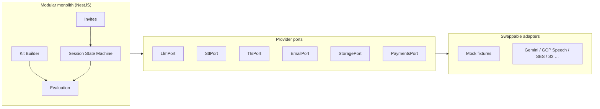
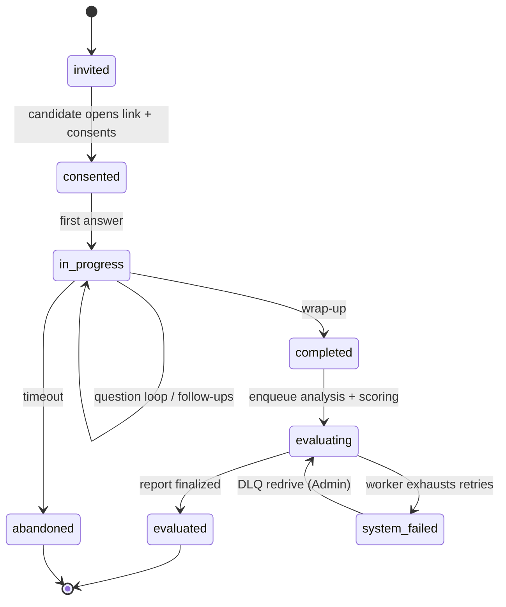
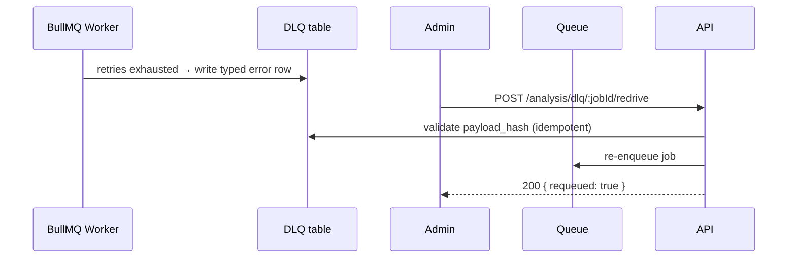
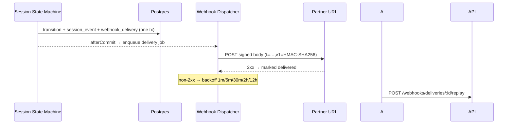
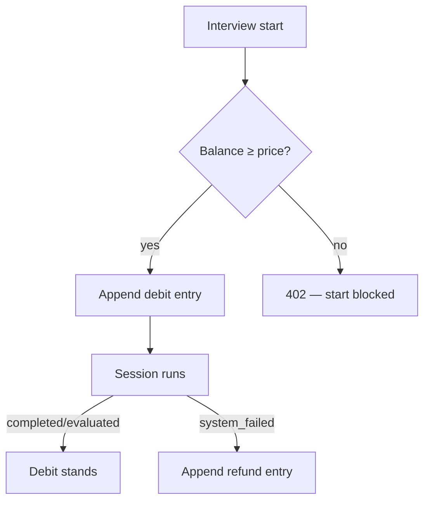
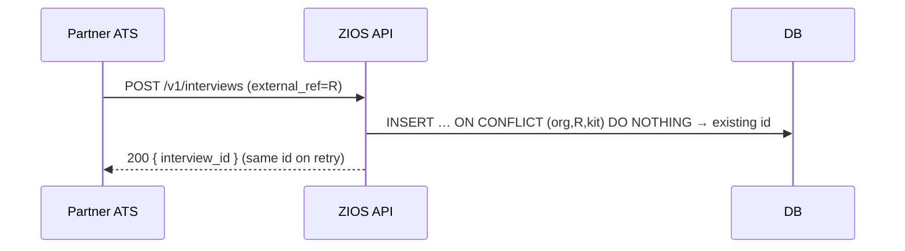

# ZIOS — Presentation Prep & Live Demo Guide

**Purpose:** everything you need to present this project to an audience — narrative arc, live-demo acts, design decisions with diagrams, and honest boundaries. Companion docs: [FEATURES](./FEATURES.md) (feature catalogue), [DEMO](./DEMO.md) (per-act demo script with fallbacks), [ARCHITECTURE](./ARCHITECTURE.md) (system design), [EXECUTIVE](./EXECUTIVE.md) (status & risks), [STATE](./STATE.md) (evidence), [Blueprint](./AI%20Interview%20Ecosystem%20Blueprint.md) (architecture source of truth), [PRD](./AI%20Interview%20Ecosystem%20PRD%20-%20MVP%20Employer%20Platform.md) (frozen scope).

**Snapshot:** 2026-09-22 · `main` @ Phases 00–09b + 14 complete, Phase 10 (Integration API) in progress.

---

## 1. The one-liner

> ZIOS is an AI interview platform where a recruiter builds an interview kit (or generates one from a JD), sends candidates a link, and gets an **evidence-linked evaluation report** — across five interview modes — while AI never auto-rejects anyone.

## 2. Narrative arc (5 acts, ~20 min talk track)

| Act | Theme             | Key message                                                                                                            |
| --- | ----------------- | ---------------------------------------------------------------------------------------------------------------------- |
| 1   | Problem & product | Hiring signal is broken: unstructured interviews, gut-feel decisions. ZIOS makes every score cite transcript evidence. |
| 2   | The five modes    | Text, voice, video, human-facilitated, async video — one evaluation backbone across all of them.                       |
| 3   | Trust by design   | Consent before capture, evidence-linked scoring, flags-not-verdicts, no emotion/personality inference.                 |
| 4   | Engineering       | Provider-independent adapters, job queues with DLQ + redrive, credits ledger, integration API + webhooks for partners. |
| 5   | Live demo         | Acts from [DEMO](./DEMO.md), ending with the integration-API act (new after Phase 10).                                 |

## 3. What exists at the end of this goal (start → bottom)

Everything below is runnable live from `docker compose up -d` plus the seeded demo scripts. Numbered in demo order:

1. **Employer onboarding** — email OTP sign-in (Mailpit shows the real email), org auto-provisioning, Admin/Interviewer roles, full tenant isolation.
2. **Dashboard (pipeline-lite)** — interview list with live statuses, kit stats, filters; rows route to the right next screen.
3. **Kit builder** — topics/questions/timers/follow-up policy, **immutable versioning** (publish freezes the snapshot every report references), preview-as-candidate.
4. **AI JD → kit generation** — paste a JD, AI proposes a kit, human edits/regenerates per question, publishes. Prompts are versioned artifacts.
5. **Invites** — single + CSV bulk, token-bound links, optional candidate OTP, reschedule-by-link, .ics for human mode.
6. **Candidate experience** — mobile-first web, consent stored _before_ any capture, preflight, practice question, session recovery on reload.
7. **Five interview modes** — text (adaptive follow-ups), voice (LiveKit audio + fallback-to-text), AI video (baseline proctoring), human-facilitated (cockpit, coverage tracking, auto-notes), async video (per-question recording, re-record allowed).
8. **Evaluation & reports** — per-criterion rubric scores **citing transcript spans** (schema rejects ungrounded scores), communication metrics, integrity panel, human override with audit trail, PDF export, time-bound share links.
9. **Multimodal analysis (Phase 14)** — objective measurements per recorded answer: camera-gaze ratio, head pose, posture, gestures, WPM, fillers, pauses, pitch/energy, blur — each with a validity flag (`n/a — reason`, never fabricated zeros).
10. **Async video hardening (Phase 09b)** — role-based creation from a synced question library, AI judge pre-fill of scorecards, human edit + submit, credit debit on create with refund-before-first-answer.
11. **Integration API (Phase 10 — this goal)**:
    - API keys (`zios_test_…` / `zios_live_…`, sha256-hashed, shown once) managed from a new employer-web **API Keys page**.
    - `POST /v1/interviews` — a partner ATS creates an interview with one call (kit or raw JD text, `candidate.external_ref` for idempotent retries), polls `GET /v1/interviews/:id`, and fetches `GET /v1/interviews/:id/scorecard` when done.
    - **Webhooks** — signed (`X-Zios-Signature: t=…,v1=HMAC-SHA256`) push notifications for session lifecycle and report-finalized events; deliveries are journaled and retried with backoff; replayable from the UI/API.
    - **Credits wallet** — single pricing map across modes, debit-on-start, automatic refund on system failure, blocked-at-zero at start (in-flight sessions get grace), low-balance email alert, wallet page in employer-web.
    - **DLQ redrive endpoints** — `POST /analysis/dlq/:jobId/redrive` and the transcription DLQ equivalent (Admin-gated), replacing manual scripts.
12. **GCP Speech-to-Text really works** — the STT adapter was validated against the live Google Cloud Speech v2 API (373 words / 150 s clip, word-level timestamps); `STT_ADAPTER=gcp` flips it via config, no code change.

## 4. Live demo acts (what to click, what to say)

Full per-act script with timings and fallback for every act is in [DEMO](./DEMO.md). After Phase 10, add:

### Act 9 — Integration API (3 min) ⭐ new

1. Employer web → new **API Keys** page → create a key → "shown once" copy dialog → key appears in list (prefix + created date only).
2. In a terminal: `curl -X POST http://localhost:3000/v1/interviews -H "Authorization: Bearer zios_test_…" -d '{…kit_id or jd_text, candidate.external_ref…}'` → returns interview id.
3. Repeat the same curl → same interview id (idempotency), say: "partners can safely retry — retries never double-create."
4. `GET /v1/interviews/:id` → status transitions; after the candidate finishes, `GET /v1/interviews/:id/scorecard` → the same evidence-linked report the UI shows.
5. Webhook: run the sandbox seed (`scripts/seed-integration-sandbox.js`) which starts a local `node:http` sink; show signature verification + retried deliveries in the webhook deliveries view; hit **Redeliver** for one event.
6. Wallet: employer-web **Wallet** page → balance, ledger entries (debit/refund/alert); trigger a failure to show the automatic refund line.
7. **Say:** "Everything a partner needs — keys, create, poll, scorecard, signed webhooks, metered credits — without a human touching our dashboard."

### Fallbacks

| Risk                            | Mitigation                                                                                            |
| ------------------------------- | ----------------------------------------------------------------------------------------------------- |
| No audience-facing partner sink | The sandbox seed starts a loopback HTTP sink; show deliveries from the employer webhook page instead. |
| Key flow too fast to narrate    | Pre-create a key, show the "reveal once" UX on a second key.                                          |

## 5. Design decisions (the "why" slides)

### 5.1 Consent before capture — a hard invariant

No media is captured before a stored consent artifact exists; analysis jobs fail closed with `CONSENT_MISSING`. This is enforced at the schema and pipeline layers, not by convention. [PRD X8](./AI%20Interview%20Ecosystem%20PRD%20-%20MVP%20Employer%20Platform.md)

### 5.2 Evidence-linked scoring

Every score cites ≥ 1 transcript span; ungrounded scores are rejected at the schema layer. Integrity output is **flags + evidence** and a named human dispositions everything — there are zero auto-reject code paths.

### 5.3 Provider independence

No feature code names a vendor. Everything external sits behind a port:

Mock adapters cover every feature path locally; real credentials swap in via env config with zero code changes. Proven live with GCP Speech v2.

### 5.4 The interview session is a saga, not a request

Every transition emits an event journaled in `session_event` — the same journal webhooks and credits refunds subscribe to.

### 5.5 Async jobs: retries, DLQ, redrive

Heavy work (transcription, multimodal analysis) runs on BullMQ workers with typed errors (never 200-with-fake). After 3 retries the job lands in a dead-letter queue. Phase 10 promotes the manual redrive script to an Admin-gated API:

### 5.6 Webhooks: journaled, signed, replayable

Hooking the existing in-transaction `session_event` journal means a delivery row is written in the same transaction as the state change — no lost events — and a BullMQ job fires the HTTP call after commit:

### 5.7 Credits wallet: ledger, not balance-mutation

Append-only `credit_ledger`; balance is derived. Debit-on-start with refund on genuine `system_failed`, blocked-at-zero only at start (in-flight sessions always finish), low-balance alert throttled to 1/24h.

### 5.8 Idempotent partner API

Partner retries must never double-create interviews. A dedicated `external_interview` table carries a unique `(org_id, external_ref, kit_version_id)` constraint; the create endpoint upserts against it:

### 5.9 No emotion / personality / face inference

The pipeline measures observable delivery behavior only — pace, fillers, pauses, gaze ratio, posture. Measurements carry validity flags; single-speaker or low-visibility segments report `n/a — reason`, never fabricated zeros.

## 6. Honest boundaries (say these before the audience asks)

- **AI never auto-rejects** — integrity output is flags; a named human dispositions.
- **No emotion/personality/lie/confidence inference** — ever, by policy and by absence of code paths.
- **Mock providers prove plumbing, not quality** — LLM quality, WER, voice latency, COGS require real keys (GCP STT already validated; Gemini adapter ready).
- **Pilot not started** — Phase 11 (notifications, hardening, load test, red-team) comes after Phase 10.
- **No production infra** — Docker Compose is dev-grade; k8s/managed decision is open.

## 7. Numbers to quote (from STATE.md §1, §4)

- 271 API tests, 104 orchestrator tests, 92 employer unit tests, 12 + 5 Playwright E2E suites — all green on `main`.
- 9 docker containers boot the entire platform with one command.
- 150 s interview clip validated live: face-visible 0.91, gaze ratio 0.971, posture upright 1.0, 16 analysis windows, 373-word GCP transcript with word timestamps.
- Codebase: strict TypeScript (frontend `.tsx` only) + strict Python (mypy), Conventional Commits, trunk-based with preserved history.

## 8. Suggested slide outline

1. Title + one-liner (§1)
2. Problem: unstructured interviews → gut-feel hiring
3. Product map: five modes, one report backbone (§3.7–3.8)
4. Live demo Acts 1–4 (onboarding → kit → candidate → async video) — [DEMO](./DEMO.md)
5. Trust design: consent, evidence, flags-not-verdicts (§5.1–5.2)
6. Multimodal analysis demo + validity-flags slide (§3.9, §5.9)
7. Engineering: ports & adapters diagram (§5.3), session saga (§5.4)
8. Partner story: API keys → create → poll → scorecard → webhooks → credits (§4 Act 9, §5.5–5.8)
9. Evidence & quality gates (§7)
10. Boundaries & roadmap: Phase 11 pilot gate (§6)
